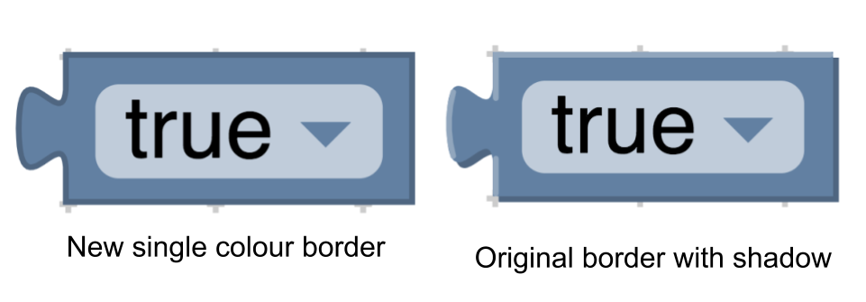

# 主题

主题是一种定制blockly外观的方法。目前，我们支持在块和类别上自定义某些样式。我们创建主题的主要目标是使开发人员能够创建更易于访问的blocly体验。

然而，强大的力量带来了巨大的责任。如果没有特别需要控制块的所有三个样式值（块颜色，边框颜色和阴影块颜色），我们强烈建议用户坚持使用块颜色。可能很难想出能够很好地结合在一起的颜色，因此最简单的入门方法仍然是使用色调定义颜色并允许块状地计算边框和阴影块的颜色。

## 块样式

块样式目前由四个字段组成：colourPrimary，colourSecondary，colourTertiary和hat。


```json
{
    "colourPrimary": "#4a148c",
    "colourSecondary":"#AD7BE9",
    "colourTertiary":"#CDB6E9"
}
```

原色（必需） - 用作块的背景色，可以用色调或十六进制值定义。

辅助颜色（可选） - 如果块是阴影块，则使用此颜色。必须将其定义为十六进制值。

三级颜色（可选） - 这是块的边框颜色。在主题之前，边框颜色由光明和黑暗路径组成，以便创建投影效果。当定义第三颜色时，它仅使用一条路径来创建平面外观（参见下图）。必须将此值定义为十六进制值。



帽子（可选） - 当用户想要将帽子添加到其块时使用。目前，此值的唯一选项是“上限”。用户可以找出在帽子和他们是用来做什么的详细信息在[这里](https://developers.google.com/blockly/guides/create-custom-blocks/block-paradigms#event_driven_program)。

## 类别风格

类别样式目前仅包含颜色属性。

```json
{
    "colour":"290"
}
```

颜色（必填） - 这是弹出按钮上类别的颜色。该值可以定义为十六进制值或色调。通常这些颜色应与该类别中大多数块的colourPrimary相同。这使用户可以轻松地分辨哪些块属于哪个类别。


## 使用主题

为了向您的块应用程序添加主题，需要完成三个步骤：

* 创建一个主题
* 添加样式名称
* 设置你的主题

### 创建一个主题

主题当前既包含块样式的地图，也包含类别样式的地图。

示例块样式图

```json
{
   "list_blocks": {
      "colourPrimary": "#4a148c",
      "colourSecondary":"#AD7BE9",
      "colourTertiary":"#CDB6E9"
   },
   "logic_blocks": {
      "colourPrimary": "#01579b",
      "colourSecondary":"#64C7FF",
      "colourTertiary":"#C5EAFF"
   }
}
```

示例类别样式图

```json
{
   "list_category": {
      "colours": "#4a148c"
   },
   "logic_category": {
      "colour": "#01579b",
   }
}
```

创建主题

```js
var theme = Blockly.Theme(blockStyles, categoryStyles);
```

### 添加样式名称
现在我们已经创建了一个主题，我们需要将样式的名称添加到块和类别定义中。

分类
对于类别，只需将样式标记添加到xml即可。

```html
<category name="Logic" categorystyle="logic_category">
</category>
```

块
如何定义块确定了如何添加样式名称。你可以找到更多的块定义在这里。

JSON:

```json
"style":"logic_blocks"
```

JAVASCRIPT:

```js
 this.setStyle('logic_blocks')
```

### 设置你的主题

现在您已经创建了一个主题并将其连接到您的块和类别，现在是时候告诉我们要使用哪个主题了。

块状选项
设置初始主题的最佳方法是options.theme在您的注入调用中包含。

```
{
    theme: Blockly.Theme(blockStyles, categoryStyles)
}
```

有关选项的更多信息，请[点击此处](https://developers.google.com/blockly/guides/get-started/web#configuration)。如果没有提供主题，则默认为经典主题，可在此处的主题文件夹中找到。

### Blockly Set主题
如果您想动态更改主题（例如，在允许用户从下拉菜单中选择主题的情况下），则可以调用 Blockly.setTheme(theme)。

## 创建块样式脚本
此脚本将采用色调或十六进制值的映射，并将为它们计算seocndary和tert颜色。该脚本可以在theme_script文件夹中找到 。

## 无障碍
我们目前添加了高对比度主题以提高可读性。此样式尚未最终确定，可能会发生变化。在未来，我们希望为具有不同类型色盲的人添加其他主题。