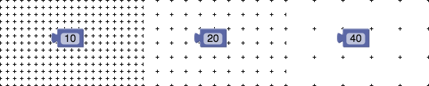
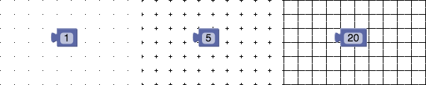
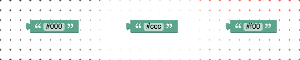

# 网格

Blockly的主工作区可以选择有一个网格。可以使块与网格对齐，从而实现更清晰的布局。这对于在大面积上分布多个代码分组的大型应用程序尤其有用。

网格的设置Blockly配置中的对象定义。这是一个例子：

```js
var workspace = Blockly.inject('blocklyDiv',
    {toolbox: document.getElementById('toolbox'),
     grid:
         {spacing: 20,
          length: 3,
          colour: '#ccc',
          snap: true},
     trashcan: true});
```

## 间距（Spacing）

最重要的网格属性是间距，它定义网格点之间的距离。默认值为0，这将导致无网格。以下是间距设置为10,20和40的示例：



## 长度（length）

length属性是一个定义网格点形状的数字。长度为0会产生不可见的网格（但仍然可以对齐），长度为1（默认值）会产生点，较长的长度会导致交叉，长度等于或大于间距结果在方格纸。以下是设置为1,5和20的长度示例：



## 颜色（Color）

color属性是一个设置点颜色的字符串。请注意使用英式英语拼写。使用任何CSS兼容格式，包括＃f00，＃ff0000或rgb（255,0,0）。默认值为＃888。以下是设置为＃000，＃ccc和＃f00的颜色示例：



## 快照（Snap）

snap属性是一个布尔值，用于设置块放置在工作区时是否应捕捉到最近的网格点。默认值为false。

