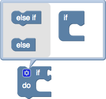

# 扩展和变异

高级模块可以使用扩展名或变异符，使其更具动态性和可配置性。

扩展允许将块的程序化配置，额外的初始化或自定义行为添加到块中。例如，几个块parent_tooltip_when_inline 在连接到另一个块时使用 扩展名显示其父级的工具提示。

增变器非常类似于扩展。除了更改块之外，它还定义了如何将那些更改保存到XML以及如何从XML加载。变量器还可以具有其他UI，供用户配置其状态。在Blockly中，最容易识别的mutator是if块。



## 扩展名

扩展是块的自定义配置或行为，可以通过块的JSON定义将其应用于块 。使用extensions键添加块的扩展名。多个扩展可以应用于单个块。

```JSON
{
  //...,
  "extensions": ["break_warning_extension", "parent_tooltip_extension"],
}
```

由于扩展执行的工作超出Blockly的默认行为，因此必须为所使用的每个平台编写一次扩展。每个平台都包括一个用于向Blockly注册扩展的API。每个扩展都定义了一个在块创建时运行的功能。将扩展名添加到块的“扩展名”键后，表示在创建该类型的每个新块时，关联函数应运行一次。

每个扩展名必须通过调用Blockly库进行注册。

```js
Blockly.Extensions.register('parent_tooltip_extension',
  function() {
    // this refers to the block that the extension is being run on
    var thisBlock = this;
    this.setTooltip(function() {
      var parent = thisBlock.getParent();
      return (parent && parent.getInputsInline() && parent.tooltip) ||
        Blockly.Msg.MATH_NUMBER_TOOLTIP;
    });
  });
```

JavaScript还为仅是mixin的扩展提供了一种便捷的方法Blockly.Extensions.registerMixin(name, mixinObj)。

## 变形

变量是在块上提供自定义可序列化状态的唯一方法。使用mutator键在块的JSON定义中声明它们。块上只能声明一个变体。

```JSON
{
  //...,
  "mutator": "controls_if_mutator",
}
```

## 注册一种形变
就像扩展一样，必须为每个平台编写一次形变，并向Blockly注册。

```js
// JS expects a mixin with all of the required methods
Blockly.Extensions.registerMutator('my_mutator_extension',
  MY_MUTATOR_MIXIN, null,
  // This last argument configures the editor UI on web
  ['my_subblock', 'my_other_subblock']);
```