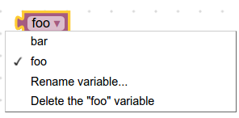
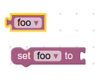
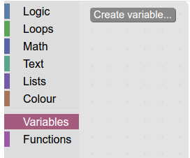
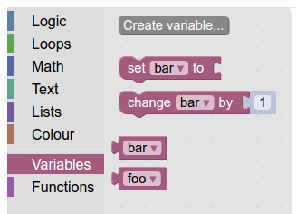

# 变量

变量是重要的编程概念。Blockly支持动态类型的语言（例如Python和Javascript），并且通过一些额外的工作，您可以添加信息以支持强类型的语言（或静态类型的语言），例如Java或C。

块式提供变量字段，这些字段是动态下拉框，显示用户提供的变量名称。下面是一个示例。



默认情况下，Blockly允许将任何类型分配给变量，并且Blockly提供的所有生成器均适用于动态类型的语言。如果您使用的是类型化的语言，则可以通过执行以下操作将Blockly配置为支持它：

* 指定变量类型及其块，包括getter和setter。
* 配置工具箱 以使用您的变量类型和块。
* 为变量及其块定义生成器。

## 无类型变量块

用于访问和操作变量的最基本的块是getter和setter块。让我们看一下Blockly提供的getter和setter块。

JSON格式
```JSON
// Block for variable getter.
{
  "type": "variables_get",
  "message0": "%1",
  "args0": [
    {    // Beginning of the field variable dropdown
      "type": "field_variable",
      "name": "VAR",    // Static name of the field
      "variable": "%{BKY_VARIABLES_DEFAULT_NAME}"    // Given at runtime
    }    // End of the field variable dropdown
  ],
  "output": null,    // Null means the return value can be of any type
  ...
},

// Block for variable setter.
{
  "type": "variables_set",
  "message0": "%{BKY_VARIABLES_SET}",
  "args0": [
    {
      "type": "field_variable",
      "name": "VAR",
      "variable": "%{BKY_VARIABLES_DEFAULT_NAME}"
    },
    {
      "type": "input_value",    // This expects an input of any type
      "name": "VALUE"
    }
  ],
  ...
}
```

这将创建以下两个块：



需要注意的一个重要细节是，通过将变量getter的“输出”设置为null，返回值可以是任何类型。另外，请注意，变量设置器的输入未指定任何检查。结果，该变量可以设置为任何类型的值。

## 类型变量块

您可以添加强制类型检查的getter和setter。例如，如果您创建了“ Panda”类型的变量，则以下定义​​将创建具有适当类型的getter和setter。

JSON格式
```JSON
 // Block for Panda variable getter.
 {
  "type": "variables_get_panda",
  "message0": "%1",
  "args0": [
    {
      "type": "field_variable",
      "name": "VAR",
      "variable": "%{BKY_VARIABLES_DEFAULT_NAME}",
      "variableTypes": ["Panda"]    // Specifies what types to put in the dropdown
    }
  ],
  "output": "Panda",    // Returns a value of "Panda"
  ...
},

 // Block for Panda variable setter.
{
  "type": "variables_set_panda",
  "message0": "%{BKY_VARIABLES_SET}",
  "args0": [
    {
      "type": "field_variable",
      "name": "VAR",
      "variable": "%{BKY_VARIABLES_DEFAULT_NAME}",
      "variableTypes": ["Panda"]
    },
    {
      "type": "input_value",
      "name": "VALUE",
      "check": "Panda"    // Checks that the input value is of type "Panda"
    }
  ],
  "previousStatement": null,
  "nextStatement": null,
  ...
}
```

这将创建两种类型的块，即getter和setter。它们的下拉列表仅显示Panda类型的变量。它们的输入和输出仅接受与Panda类型的连接。

默认情况下，没有视觉指示器来告诉用户正在使用哪种类型。区分变量类型的一种简单方法是按颜色。

注意：variableTypes键在field_variable上是可选的。如果未定义，将仅显示空字符串类型“”的变量。要显示任何类型的所有变量，请使用“ variableTypes”：null。

## 将变量添加到工具箱

为了使这种新类型的变量对用户有用，您需要添加一种创建和使用新变量的方法。

如果您还没有变量，请为其创建一个新的 动态类别。



将新的吸气剂和吸气剂添加到类别中。



如果您不希望用户可以访问未类型化的变量，则需要从工具箱中删除其getter和setter。

## 创建变量按钮

接下来，您的用户需要一种创建变量的方法。最简单的方法是使用“创建变量” 按钮。

创建按钮时，进行回叫

```js
Blockly.Variables.createVariable(button.getTargetWorkspace(), null, 'panda');
```

然后将创建一个熊猫类型的变量！

允许用户创建多种类型的变量的最简单方法是每种类型具有一个“创建”按钮（例如，创建字符串变量，创建数字变量，创建熊猫变量）。如果变量类型多于两种或三种，则很快就会出现太多按钮。在这种情况下，请考虑其他选项，例如用包含类型选择器的选项替换变量创建模式。

## 定义生成器

最后，您将需要 为新的变量块定义生成器。您也可以直接使用Blockly.Workspace.getAllVariables（）访问变量列表，以获取所有类型的所有变量，或者使用Blockly.Workspace.getVariablesOfType（）获取特定类型的所有变量。