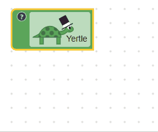

# 字段解析

## 值

所有字段都必须具有一个值，这是该字段数据的真实来源。 它可以是任何类型（字符串，数字，数组，日期等）。 字段可以使用验证器来限制值或转换为机器可读格式（例如，规范化日期格式）。

## 文本

所有字段都包含文本，该文本是一个易于理解的简单字符串，表示字段的值。 这并不一定意味着它们相同。例如，布尔字段上的文本可能为“ On”或“ Off”，而其值为“ true”或“ false”。

该文本是为便于访问而折叠块时显示的内容，并且可以选择作为块上显示的一部分。

## 可编辑字段 vs 不可编辑字段

通常，可编辑字段允许用户更改代码，而不可编辑字段则向用户显示有关块的信息。 单击可编辑字段时，可能会显示一个丰富的编辑器。

可编辑字段包括：
* Checkbox （复选框）
* Colour （颜色）
* Dropdown （下拉菜单）
* Number （数字）
* Text Input （文本输入）

不可编辑字段包括：
* Label （标签）
* Label Serializable （标签可序列化）
* Image （图片）

## 序列化

可序列化字段的值以XML保存格式编码。 所有可编辑字段都是可序列化的，因为它们的值是动态的。 不可编辑字段的值通常不是动态的，因此通常不会序列化。

可序列化字段包括：
* Checkbox （复选框）
* Colour （颜色）
* Dropdown （下拉菜单）
* Number （数字）
* Text Input （文本输入）
* Label Serializable （标签可序列化）

不可序列化字段包括：
* Label （标签）
* Image （图片）

请注意“标签可序列化”字段不可编辑，但可序列化。 这意味着只能以编程方式对其进行编辑，而不能通过用户可见的UI进行编辑。 编辑后，其值将编码在生成的XML中。

## 代码生成

除了连接和断开块外，字段是用户可以控制Blockly生成的代码的唯一方法。 字段提供的编辑器使用户可以修改字段存储的值。 随后块的生成器可以访问该字段的值以在生成的代码中使用。

## 块上显示

字段的块上显示是表示字段值的SVG元素的集合。 它们占用了块上的空间，并且随着它们更改大小，它们迫使块更改大小。 字段的块上显示可以是简单的，也可以是复杂的，具体取决于其需求。

下述是不同的块上显示器的一些示例，以增加复杂性的顺序。

| 字段类型 | 描述 |
|:-:|:----:|
| Label | 仅含一个文本元素 |
| Angel | 包含背景矩形，文本元素和度数符号。 |
| Turtle | 包含背景矩形，文本元素和许多用于构造turtle图形的SVG元素。 |

## 编辑器显示

当用户点击可编辑字段时，该字段可能会显示任意复杂的编辑器。

下述是不同编辑器的一些示例，按照复杂度递增的顺序排列。

| 字段类型 | 描述 |
|:-:|:----:|
| Checkbox | 单击时没有编辑器。 块上显示将更新。 |
| Number input | 文本编辑器覆盖在块上显示器上方。 用户可以输入； 编辑器可能会更改颜色以指示错误的值。 |
| Angle picker | 角度选择器同时具有用于输入数字的文本编辑器和用于可视地选择角度的可拖动编辑器。 |

## 其他显示模块

折叠模式：用户折叠该块。该块使用各个字段返回的文本显示其值的文本表示。

辅助功能模式：用户可能正在使用屏幕阅读器或类似技术与Blockly进行交互。 该字段的文本可以被读出给用户。