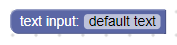
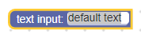
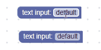

# 文本输入

文本输入字段存储字符串作为其值和字符串作为其文本。 它的值始终是有效的字符串，而其文本可以是输入到其编辑器中的任何字符串。





## 新建

```json
{
  "type": "example_textinput",
  "message0": "text input: %1",
  "args0": [
    {
      "type": "field_input",
      "name": "FIELDNAME",
      "text": "default text",
      "spellcheck": false
    }
  ]
}
```
```js
```

文本输入构造函数接受一个可选值和一个可选验证器。 该值应转换为字符串。 如果为null或未定义，则将使用空字符串。

JSON定义还允许您设置拼写检查选项。

## 可序列化和xml

文本输入字段的XML如下所示：

```xml
<field name="FIELDNAME">text</field>
```

其中字段的名称属性包含引用文本输入字段的字符串，而内部文本是要应用于该字段的值。 内部文本值遵循与构造函数值相同的规则。

## 定制

### 拼写检查

setSpellcheck函数可用于设置字段是否拼写检查其输入文本。



默认情况下，拼写检查处于启用状态。

这适用于各个字段。 如果要修改所有字段，请更改Blockly.FieldTextInput.prototype.spellcheck_属性。

## 创建文本输入验证器

文本输入字段的值是一个字符串，因此任何验证器都必须接受一个字符串并返回一个字符串，null或undefined。

这是一个验证程序的示例，该验证程序从字符串中删除所有“ a”字符：

```js
function(newValue) {
  return newValue.replace(/\a/g, '');
}
```

