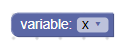
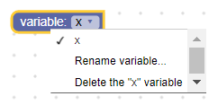
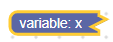
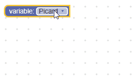

# 变量

变量字段存储一个字符串作为其值，并存储一个字符串作为其文本。 值是变量的ID，而文本是变量的名称。





## 新建

### 未键入的

```json
{
  "type": "example_variable_untyped",
  "message0": "variable: %1",
  "args0": [
    {
      "type": "field_variable",
      "name": "FIELDNAME",
      "variable": "x"
    }
  ]
}
```
```js
```
### 键入的

```json
{
  "type": "example_variable_typed",
  "message0": "variable: %1",
  "args0": [
    {
      "type": "field_variable",
      "name": "FIELDNAME",
      "variable": "x",
      "variableTypes": ["Number", "String"],
      "defaultType": "Number"
    }
  ]
}
```
```js
```

变量构造函数采用可选的变量名称，可选的验证器，可选的变量类型数组和可选的默认类型。

* 变量名称应为字符串。 这将是该字段保存的初始变量的名称。 如果为null或未定义，则将生成一个唯一的名称。
* 变量类型应为字符串数组。 这告诉该字段该字段可以保存哪些类型的变量（即要添加到下拉列表的变量的类型）。 如果为null或未定义，则将接受所有变量类型（并将其添加到下拉列表中）。
* 默认类型应为字符串。 在创建字段的初始变量模型时将使用它。 如果已定义，则应将其包含在变量类型数组中。 如果为null或未定义，则该值默认为空字符串，这意味着将灵活键入初始变量。

## 可序列化和XML 

变量字段的XML如下所示：

```xml
<field name="VARIABLE" id="QJD^+@[RVIwbLSZoDb:V" variabletype="">name</field>
```

* 节点的名称属性包含引用变量字段的字符串。
* 节点的id属性包含字段引用的变量的ID。 默认为字符汤，但任何非空文本字符串均有效。
* 节点的variabletype属性包含变量的类型。 variabletype属性遵循与构造函数的默认类型参数相同的规则。
* 节点的内部文本是变量的名称。 内部文本值遵循与构造函数的变量名参数相同的规则。

## 新建一个变量验证器

变量字段的值是字符串，因此任何验证器都必须接受字符串并返回字符串，null或undefined。

这是一个验证器的示例，该验证器仅接受一些预定义的变量作为选项。 加载工作空间时，需要使用Workspace.createVariable函数定义这些变量。

```js
function(newValue) {
  var validIds = ['Worf', 'Riker', 'Picard'];
  if (validIds.indexOf(newValue) == -1) {
    return null;
  }
  return newValue;
}
```

