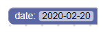
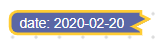
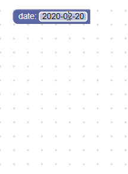

# 日期

日期字段存储一个字符串作为其值，并存储一个字符串作为其文本。 其值和文本均具有YYYY-MM-DD格式。





警告：由于使用受限且占用空间大，因此默认情况下，FieldDate不会编译为Blockly。 要使用它，您将需要它并进行重建。 将goog.require（'Blockly.FieldDate'）添加到您的项目中，或在blockly.js中取消注释以启用它。

## 创建

```JSON
{
  "type": "example_date",
  "message0": "date: %1",
  "args0": [
    {
      "type": "field_date",
      "name": "FIELDNAME",
      "date": "2020-02-20"
    }
  ]
}
```

日期字段构造函数采用一个可选值和一个可选验证器。 该值应该是格式为YYYY-MM-DD的字符串。 否则，将使用当前（今天）的日期。

## 可序列化和XML

日期字段的XML如下所示：

```xml
<field name="FIELDNAME">2020-02-20</field>
```

## 创建日期验证器

日期字段的值是YYYY-MM-DD格式的字符串，因此任何验证器都必须接受YYYY-MM-DD格式的字符串，并返回YYYY-MM-DD格式的字符串，空值或未定义。

请注意，在验证日期时，使用Closure的日期类可能很有用。

这是仅接受工作日的验证程序的示例：

```js
function(newValue) {
  var date = goog.date.Date.fromIsoString(newValue);
  var weekday = date.getWeekday();
  if (weekday == 0 || weekday == 6) {
    return null;
  }
  return date.toIsoString(true);
}
```

