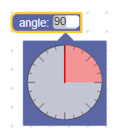
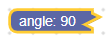
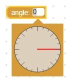
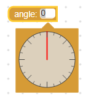
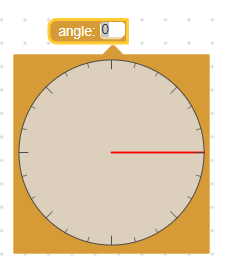

# 角度字段

角度字段存储数字作为其值，并存储字符串作为其文本。 它的值是0到360之间的数字（可以更改此范围），而其文本可以是输入到其编辑器中的任何字符串。

角度字段


带编辑器的角度字段



压缩的角度字段



## 创造

```JSON
{
  "type": "example_angle",
  "message0": "angle: %1",
  "args0": [
    {
      "type": "field_angle",
      "name": "FIELDNAME",
      "angle": 90
    }
  ]
}
```
```js

```

angle构造函数接受一个可选值和一个可选验证器。 如果没有给定值或给定值未转换为数字，则将零用作默认值。

## 可序列化和XML

角度字段的XML如下所示：

```XML
<field name="FIELDNAME">0</field>
```

其中name属性包含引用角度字段的字符串，而内部文本是要应用于该字段的值。 内部文本值遵循与构造函数值相同的规则。

## 定制

### 捕捉

Blockly.FieldAngle.ROUND属性将更改使用鼠标时角度选择器“捕捉”的值。

注意： 这不会影响角度字段的文本输入部分，因此，如果要确保角度值是四舍五入的，请使用验证器。

以下是ROUND值为70的示例：


ROUND属性默认为15。如果要禁用捕捉，请将其设置为0。

这是全局属性，因此设置后将修改所有角度字段。

### 方向性

Blockly.FieldAngle.CLOCKWISE属性更改使角度值增加的方向。 将此值设置为true会使角度随着选择器顺时针移动而增大，设置为false会使角度随着逆时针方向移动而增大。

CLOCKWISE 设为true：


CLOCKWISE 设为false：


CLOCKWISE属性默认为false，这意味着逆时针运动将使角度增加。

这是全局属性，因此设置后将修改所有角度字段。

### 零位置

TheBlockly.FieldAngle.OFFSET属性设置0度所在的位置。 默认情况下，零度与正x轴（向右）对齐，然后此属性将该位置“偏移”若干度。

注意：偏移的方向始终是逆时针，与CLOCKWISE属性无关。




OFFSET属性默认为0，表示零度与正x轴对齐。

这是一个全局属性，因此设置后将修改所有角度字段。

### 范围

Blockly.FieldAngle.WRAP属性设置值的范围。 值的范围等于（-360 + WRAP，WRAP）。 这意味着WRAP值360将给出范围（0，359.9），而WRAP值180将给出范围（-179.9，180）。


WRAP属性默认为360，这意味着该字段的范围为（0，359.9）。

这是一个全局属性，因此设置后将修改所有角度字段。

### 角度选择器的尺寸

Blockly.FieldAngle.HALF属性更改角度选择器的大小。 此值以像素为单位定义外圆的半径。




HALF属性默认为50。

这是一个全局属性，因此设置后将修改所有角度字段。

注意：角度选择器的大小不受工作区规模的影响。

## 普通模式

方向和零位置可一起使用以创建一些有趣的组合。 这是两个常见的：

1. 量角器

0°是右，90°是上。

```js
Blockly.FieldAngle.CLOCKWISE = false;
Blockly.FieldAngle.OFFSET = 0;
```


2. 罗盘

0°是上，90°是右。

```js
Blockly.FieldAngle.CLOCKWISE = true;
Blockly.FieldAngle.OFFSET = 90;
```


## 创建一个角度选择器

angle字段的值是一个数字，因此任何验证器都必须接受一个数字并返回一个数字，null或undefined。

这是一个验证器的示例，该验证器将值强制为30的倍数：

```js
function(newValue) {
    return Math.round(newValue / 30) * 30;
}
```


请注意，角度字段的[ROUND]（＃snapping）属性如何仍设置为15，因此该字段的图形元素显示15的倍数，而不是30的倍数。