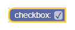
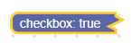
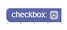
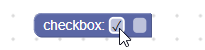

# 复选框

复选框字段存储一个字符串作为其值，以及一个字符串作为其文本。 其值为“ TRUE”或“ FALSE”，其文本为“ true”或“ false”。

复选框字段



压缩的复选框字段



## 新建复选框字段

```json
{
  "type": "example_checkbox",
  "message0": "checkbox: %1",
  "args0": [
    {
      "type": "field_checkbox",
      "name": "FIELDNAME",
      "checked": true
    }
  ]
}
```

复选框构造函数接受一个可选值和一个可选验证器。 可选值应为“ TRUE”，“ FALSE”或布尔值，否则它将默认为false。

## 可序列化和XML

复选框对应的XML代码如下所示:

```xml
<field name="FIELDNAME">TRUE</field>
<field name="FIELDNAME">true</field>
```

注意: 引号不需要应用于内部文本。

name属性包含一个引用复选框字段的字符串，内部文本是该字段的值。 内部文本值遵循与构造函数值相同的规则。

请注意，在反序列化和重新序列化之后，所有内部文本值都将大写（“ TRUE”或“ FALSE”）。 在区分工作空间时，这有时很重要。

## 定制化

### 复选标记字符

Blockly.FieldCheckbox.CHECK_CHAR属性可用于更改选中标记的外观。 该值应该是包含Unicode字符的字符串。



CHECK_CHAR属性默认为'\u2713'或✓。

这是全局属性，因此设置后将修改所有复选框字段。

## 创建一个复选框验证器

复选框字段的值为“ TRUE”或“ FALSE”，因此验证程序应接受这些值（即字符串），并返回“ TRUE”，“ FALSE”，null或undefined。

错误警告：不应在验证程序内部使用getValueBoolean方法，因为它基于当前值而不是新值返回。

这是一个验证器的示例，该验证器根据是否选中复选框来隐藏或显示文本输入字段：

```js
 validate: function(newValue) {
    var sourceBlock = this.getSourceBlock();
    sourceBlock.showTextField_ = newValue == 'TRUE';
    sourceBlock.updateTextField();

    return newValue;
  },

  updateTextField: function() {
    var input = this.getInput('DUMMY');
    if (this.showTextField_ && !this.getField('TEXT')) {
      input.appendField(new Blockly.FieldTextInput(), 'TEXT');
    } else if (!this.showTextField_ && this.getField('TEXT')) {
      input.removeField('TEXT');
    }
  }
```

