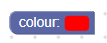
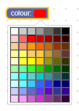
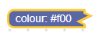
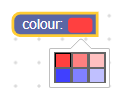

# 颜色选择器

颜色字段存储一个字符串作为其值，并存储一个字符串作为其文本。 它的值是格式为#rrggbb的字符串，而其文本也可以是格式为#rgb的字符串。

颜色字段



打开编辑器的颜色字段



压缩的颜色字段



## 新建

```json
{
  "type": "example_colour",
  "message0": "colour: %1",
  "args0": [
    {
      "type": "field_colour",
      "name": "FIELDNAME",
      "colour": "#ff0000"
    }
  ]
}
```

颜色字段构造函数采用一个可选值和一个可选验证器。 该值应该是格式为“ #rrggbb”的字符串。 如果未提供任何值或给定的值无效，则将使用默认颜色数组中的第一项。

## 可序列化和XML

颜色选自器对应的XML代码如下所示:

```xml
<field name="FIELDNAME">#ff0000</field>
```

字段节点的名称属性包含一个引用颜色字段的字符串，该节点的内部文本是要应用于该字段的值。 内部文本值遵循与构造函数值相同的规则。

请注意，在反序列化和重新序列化之后，所有内部文本值将采用#rrggbb格式。 在区分工作空间时，这有时很重要。

## 定制化

### 编辑器选项

setColours函数可用于设置颜色字段的颜色选项。 它采用一个颜色字符串数组（必须以#rrggbb格式定义）和一个可选的工具提示数组。 如果未提供工具提示数组，则将使用默认的工具提示数组。

工具提示和颜色是根据数组索引而不是值来匹配的。 如果colors数组比工具提示数组长，则额外颜色的工具提示将为其#rrggbb值。

setColumns函数设置颜色选择器中的列数。

```json
{
  "type": "example_colour",
  "message0": "colour: %1",
  "args0": [
    {
      "type": "field_colour",
      "name": "COLOUR",
      "colour": "#ff4040"
    }
  ],
  "extensions": ["set_colours_extension"]
  这是使用JSON扩展名完成的。
}
```
```js

Blockly.Extensions.register('set_colours_extension',
  function() {
    var field = this.getField("COLOUR");
    field.setColours(
      ['#ff4040', '#ff8080', '#ffc0c0',
        '#4040ff', '#8080ff', '#c0c0ff'],
      ['dark pink', 'pink', 'light pink',
        'dark blue', 'blue', 'light blue']);
    field.setColumns(3);
  });
```



可选地,默认颜色，工具提示和列可以全局覆盖。 这意味着它们将影响所有颜色字段，而不是特定字段。

```js
Blockly.FieldColour.COLOURS = [
    '#ff4040', '#ff8080', '#ffc0c0',
    '#4040ff', '#8080ff', '#c0c0ff'];
Blockly.FieldColour.TITLES = [
    'dark pink', 'pink', 'light pink',
    'dark blue', 'blue', 'light blue'];
Blockly.FieldColour.COLUMNS = 3;
```

## 新建一个颜色选择器

颜色字段的值是#rrggbb格式的字符串，因此任何验证器都必须接受#rrggbb格式的字符串，并返回#rrggbb格式的字符串，null或undefined。

这是一个验证器的示例，它更改块的颜色以匹配块的颜色。

```js
function(newValue) {
  this.getSourceBlock().setColour(newValue);
  return newValue;
}
```

根据色域阻止更改颜色

