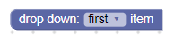
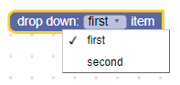
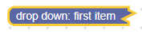
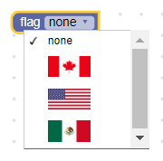
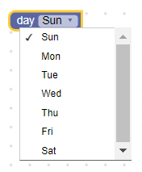
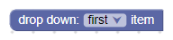
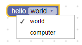
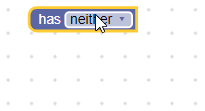

# 下拉菜单

下拉字段存储一个字符串作为其值和一个字符串作为其文本。 该值是与语言无关的键，将用于访问文本，并且在语言之间切换Blockly时不会翻译。 文本是人类可读的字符串，将显示给用户。

下拉字段



下拉字段展开



下拉字段压缩



## 新建

下拉构造函数接受菜单生成器和可选的验证器。 菜单生成器具有很大的灵活性，但是本质上是一个选项数组，每个选项都包含一个人类可读的部分以及一个与语言无关的字符串。

### 简单的文字下拉菜单


```json
{
  "type": "example_dropdown",
  "message0": "drop down: %1",
  "args0": [
    {
      "type": "field_dropdown",
      "name": "FIELDNAME",
      "options": [
        [ "first item", "ITEM1" ],
        [ "second item", "ITEM2" ]
      ]
    }
  ]
}
```

将人类可读信息与语言无关键分开，可以在语言之间保留下拉菜单的设置。 例如，块的英文版可以定义[[''left'，'LEFT']，['right'，'RIGHT]]，而同一块的德文版可以定义[['links'，'LEFT'] ，['rechts'，'RIGHT]]。

### 图片下拉菜单

下拉菜单中的选项也可以是图像而不是文本。 图像对象使用src，width，height和alt属性指定。

请注意，尽管下拉菜单可以混合使用文本选项和图像选项，但是单个选项当前不能同时包含图像和文本。



```json
{
  "type": "image_dropdown",
  "message0": "flag %1",
  "args0": [
    {
      "type": "field_dropdown",
      "name": "FLAG",
      "options": [
        ["none", "NONE"],
        [{"src": "canada.png", "width": 50, "height": 25, "alt": "Canada"}, "CANADA"],
        [{"src": "usa.png", "width": 50, "height": 25, "alt": "USA"}, "USA"],
        [{"src": "mexico.png", "width": 50, "height": 25, "alt": "Mexico"}, "MEXICO"]
      ]
    }
  ]
}
```

### 可滚动的下拉菜单



```json
{
  "type": "dynamic_dropdown",
  "message0": "day %1",
  "args0": [
    {
      "type": "input_dummy",
      "name": "INPUT"
    }
  ],
  "extensions": ["dynamic_menu_extension"]
}
```
```js
Blockly.Extensions.register('dynamic_menu_extension',
  function() {
    this.getInput('INPUT')
      .appendField(new Blockly.FieldDropdown(
        function() {
          var options = [];
          var now = Date.now();
          for(var i = 0; i < 7; i++) {
            var dateString = String(new Date(now)).substring(0, 3);
            options.push([dateString, dateString.toUpperCase()]);
            now += 24 * 60 * 60 * 1000;
          }
          return options;
        }), 'DAY');
  });
```

下拉菜单还可以提供功能，而不是提供静态选项列表，从而可以使选项动态化。 该函数应以与静态选项相同的[human-readable-value，language-neutral-key]格式返回选项数组。 每次单击下拉菜单时，都会运行该函数并重新计算选项。

注意: 动态下拉列表不会出现前缀/后缀匹配。

## 可序列化和XML

### 下拉箭头

Blockly.FieldDropdown.ARROW_CHAR属性可用于更改表示下拉箭头的Unicode字符。



在Android上，ARROW_CHAR属性默认为\u25BC（▼），否则为\u25BE（▾）。

这是全局属性，因此设置后将修改所有下拉字段。

### 菜单高度

Blockly.FieldDropdown.MAX_MENU_HEIGHT_VH属性可用于更改菜单的最大高度。 它定义为视口高度的百分比，视口是窗口。

MAX_MENU_HEIGHT_VH属性默认为0.45。

这是全局属性，因此设置后将修改所有下拉字段。

## 前缀/后缀匹配

如果所有下拉菜单选项共享共同的前缀和/或后缀词，则这些词会自动分解并作为静态文本插入。 例如，以下是创建同一块的两种方法（第一种没有后缀匹配，第二种带有后缀）：

1. 没有后缀匹配:

```json
{
  "type": "dropdown_no_matching",
  "message0": "hello %1",
  "args0": [
    {
      "type": "field_dropdown",
      "name": "MODE",
      "options": [
        ["world", "WORLD"],
        ["computer", "CPU"]
      ]
    }
  ]
}
```
```js
```

2. 有后缀匹配

```json
{
  "type": "dropdown_with_matching",
  "message0": "%1",
  "args0": [
    {
      "type": "field_dropdown",
      "name": "MODE",
      "options": [
        ["hello world", "WORLD"],
        ["hello computer", "CPU"]
      ]
    }
  ]
}
```
```js
```



这种方法的一个优点是该块更易于翻译成其他语言。 较早的代码具有字符串“ hello”，“ world”和“ computer”，而修订后的代码具有字符串“ hello world”和“ hello computer”。 译者比单独的单词翻译短语要容易得多。

这种方法的另一个优点是单词顺序经常在语言之间变化。 想象一下使用“世界问候”和“计算机问候”的语言。 后缀匹配算法将检测到常见的“ hello”并在下拉列表后显示。

但是，有时前缀/后缀匹配失败。 在某些情况下，两个单词应始终在一起，并且不应排除前缀。 例如，可以说“红色驾驶汽车”和“红色驾驶卡车”应该仅考虑“驾驶”，而不考虑“红色驾驶”。 可以使用Unicode不间断空格'\u00A0'代替常规空格来抑制前缀/后缀匹配器。 因此，上面的示例可以通过'drive red\u00A0car'和'drive red\u00A0truck'进行修复。

前缀/后缀匹配失败的另一个地方是使用不会用空格分隔单个单词的语言。 中文就是一个很好的例子。 字符串“访问中国”的意思是“visit China”，请注意单词之间没有空格。 总的来说，后两个字符（“中国”）代表“China”，但是如果分开，则分别表示“中心”和“国家”。 要使前缀/后缀匹配在中文等语言中起作用，只需在分隔符处插入一个空格即可。 例如，“visit [China/USA]”将导致“访问中国/美国”，而“访问 中 国”和“访问 美 国”将导致“访问[中心的/美丽的]国家”。

## 新建一个下拉菜单

下拉字段的值是与语言无关的字符串，因此任何验证器都必须接受一个字符串并返回一个可用选项，为null或未定义的字符串。

例如，如果您的字段具有以下选项：

```
['has neither', 'NEITHER'],
['has statement', 'STATEMENT'],
['has value', 'VALUE'],
```

您可以创建一个验证器，该验证器根据下拉值添加或删除输入。

```js
validate: function(newValue) {
  this.getSourceBlock().updateConnections(newValue);
  return newValue;
},

updateConnections: function(newValue) {
  this.removeInput('STATEMENT', /* no error */ true);
  this.removeInput('VALUE', /* no error */ true);
  if (newValue == 'STATEMENT') {
    this.appendStatementInput('STATEMENT');
  } else if (newValue == 'VALUE') {
    this.appendValueInput('VALUE');
  }
}
```

