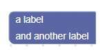
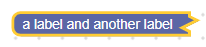

# 标签

标签字段存储字符串作为其值和字符串作为其文本。 标签字段的值和文本始终相同。




## 新建

```json
{
  "type": "example_label",
  "message0": "a label %1 and another label",
  "args0": [
    {
      "type": "input_dummy"
    }
  ]
}
```
```js
```

插值参数之间的任何消息文本都将成为标签字符串。 可选地，标签可以作为对象或文本显式内插。 通常不建议这样做，因为这会使翻译更加困难。

```json
{
  "type": "example_label",
  "message0": "%1 %2 %3",
  "args0": [
    {
      "type": "field_label",
      "text": "a label"
    },
    {
      "type": "input_dummy"
    },
    "and another label"
  ]
}
```
```js
```

appendField函数既可以接受FieldLabel对象，也可以接受字符串来创建标签。

label字段接受一个可选值和一个可选css类字符串。 两者都默认为空字符串。

## 序列化和XML

标签字段不可序列化，这意味着它们不会保存为XML。

如果您希望将标签序列化为XML，因为已通过编程方式对其进行了更改，请参见“可序列化标签”字段。

## 验证器

标签字段不支持验证器，因为它们不可编辑。