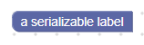

# 可序列化标签

可序列化标签的工作方式与普通标签完全相同，只是它们也可以序列化为XML。 仅当您以编程方式编辑标签的内容并希望将其序列化为XML时，才应使用它们。




## 新建

```json
{
  "type": "example_serializable_label",
  "message0": "%1",
  "args0": [
    {
      "type": "field_label_serializable",
      "name": "FIELDNAME",
      "text": "a serializable label"
    }
  ]
}
```
```js
```

可序列化标签字段采用可选值和可选CSS类字符串。 两者都默认为空字符串。

## 可序列化和XML

可序列化标签字段的XML如下所示：

```xml
<field name="FIELDNAME">text</field>
```

字段节点的name属性包含一个引用可序列化标签字段的字符串，该节点的内部文本是要应用于该字段的值。

## 验证器

可序列化标签字段不支持验证器，因为它们不可编辑。