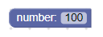
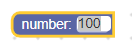
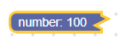
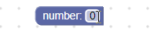

## 数字

数字字段存储数字作为其值，并存储字符串作为其文本。 它的值始终是有效的数字，该数字由创建时赋予该字段的约束定义； 它的文本可以是输入到其编辑器中的任何字符串。





## 新建

```json
{
  "type": "example_number",
  "message0": "number: %1",
  "args0": [
    {
      "type": "field_number",
      "name": "FIELDNAME",
      "value": 100,
      "min": 0,
      "max": 100,
      "precision": 10
    }
  ]
}
```
```js
```

数字构造函数接受以下内容：

* 可选值
* 可选的分钟
* 可选的最大值
* 可选精度
* 可选的验证器

该值应转换为数字。 如果不是，将使用0。

## 可序列化和XML

数字化标签字段的XML如下所示：

```xml
<field name="FIELDNAME">0</field>
```

字段节点的name属性包含一个引用数字字段的字符串，该节点的内部文本是要应用于该字段的值。 内部文本值遵循与构造函数值相同的规则。

## 约束条件

可以在字段定义中设置约束，也可以使用setConstraints函数设置约束。

### 最小值

最小值设置允许字段包含的最小/最大负值。

### 最大值

最大值设置允许该字段包含的最大/最正值。

### 精度

精度会将值四舍五入到最接近的精度倍数。 这可用于使该字段仅接受.01、10、42等的倍数。

## 一般约束条件

### 正数

要强制您的字段仅接受正数，请将最小值设置为1。

### 整数

要强制您的字段仅接受整数，请将精度设置为1。

## 新建一个数字验证器

数字字段的值是数字，因此任何验证器都必须接受数字并返回数字，空值或未定义。

这是一个验证器的示例，该验证器根据值是奇数还是偶数将值更改为0或1。

```js
function(newValue) {
  return newValue % 2;
}
```
