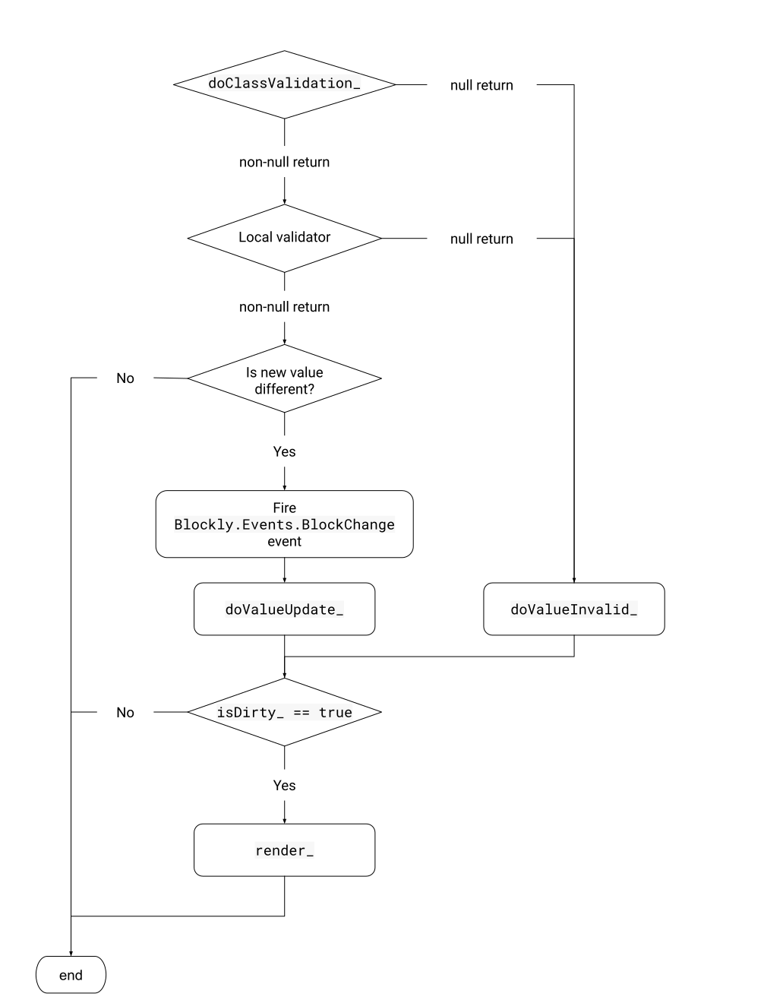
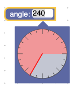
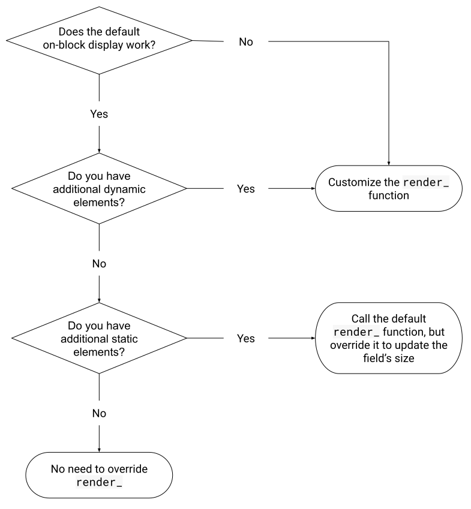

# 创建自定义字段

在创建新的字段类型之前，请考虑其他自定义字段的方法是否适合您的需求。 如果您的应用程序需要存储新的值类型，或者希望为现有的值类型创建新的UI，则可能需要创建一个新的字段类型。

要创建一个新字段，请执行以下操作：
1. 实现一个构造函数
2. 注册一个JSON密钥并实现fromJson
3. 处理块上UI和事件侦听器的初始化
4. 处理事件侦听器（已为您进行了UI处理）
5. 实现值处理
6. 添加字段值的文本表示形式，以实现可访问性
7. 添加其他功能，例如：
    * 一位编辑
    * 块上显示更新
    * 序列化
8. 配置字段的其他方面，例如：
    * 可编辑和可序列化的属性
    * 光标

本节假定您已阅读并熟悉字段剖析中的内容。

## 实现一个构造函数

字段的构造函数负责设置字段的初始值，并可以选择设置本地验证器。无论源块是在 JSON 还是 JavaScript 中定义，自定义字段的构造函数都会在源块初始化期间调用。因此，自定义字段在构造期间无法访问源块。

以下代码示例创建名为"泛型字段"的自定义字段：

```js
'use strict';

goog.provide('CustomFields.GenericField');

goog.require('Blockly.Field');

CustomFields.GenericField = function(opt_value, opt_validator) {
  opt_value = this.doClassValidation_(opt_value);
  if (opt_value === null) {
    opt_value = CustomFields.GenericField.DEFAULT_VALUE;
  }  // Else the original value is fine.

  CustomFields.GenericField.superClass_.constructor.call(
      this, opt_value, opt_validator);
};
goog.inherits(CustomFields.GenericField, Blockly.Field);
```

错误警告：请确保在创建自定义字段时正确提供、要求和继承。

### 方法签名

字段构造函数通常采用一个值和一个本地验证器。 如果您的字段有逻辑默认值，则该值通常是可选的。 验证器参数仅在可编辑字段中存在，通常标记为可选。

### 结构

构造函数内部的逻辑应遵循以下流程：

1. 使用this.doClassValidation_验证传递的值（请参阅类验证器）。
字段的值始终存储为单个对象。 因此，如果在构造函数中有多个单独证明的值，则应在验证之前将它们编译为单个对象。

2. 通过设置默认值或引发清除错误来处理无效值。

3. 可选：应用其他自定义项（例如，“标签”字段允许传递css类，然后将其应用于文本）。

4. 调用继承的超级构造函数（所有自定义字段都应继承自Blockly.Field）以正确初始化值并为您的字段设置本地验证器。

## JSON和注册

在JSON块定义中，字段由字符串（例如field_number，field_textinput）描述。 Blockly维护从这些字符串到字段对象的映射，并在构造过程中在适当的对象上调用fromJson。

调用Blockly.Fields.register将您的字段类型添加到此地图，并将字段类作为第二个参数传递：

```js
Blockly.Field.register('field_generic', CustomFields.GenericField);
```

您还需要定义fromJson函数。 您的实现应首先使用replaceMessageReferences解引用所有字符串表引用，然后将值传递给构造函数。

```js
CustomFields.GenericField.fromJson = function(options) {
  var value = Blockly.utils.replaceMessageReferences(
      options['value']);
  return new CustomFields.GenericField(value);
};
```

注意: 使用JSON定义时，当前不支持验证器。 但是它们可以通过扩展来应用。

## 初始化

构造字段时，它基本上仅包含一个值。 初始化是构建DOM，构建模型（如果字段拥有模型）和绑定事件的地方。

## 块上显示

在初始化期间，您负责创建该字段块上显示所需的任何内容。

### 默认值，背景和文本

默认使用initView函数来创建浅色的rect元素和text元素。 如果您希望字段同时具有这两个优点以及一些其他优点，请在添加其余DOM元素之前调用超类initView函数。 如果希望您的字段具有这些元素中的一个，但不能同时具有这两个元素，则可以使用createBorderRect_或createTextElement_函数。

### 自定义DOM构建

如果您的字段是通用文本字段（例如，文本输入或日期），则将为您处理DOM构造。 否则，您将需要重写initView函数来创建将来在渲染字段时所需的DOM元素。

例如，下拉字段可能同时包含图像和文本。 在initView中，它创建一个图像元素和一个文本元素。 然后，在render_期间，它会根据所选选项的类型显示活动元素，并隐藏另一个元素。

可以使用Blockly.utils.dom.createSvgElement方法或使用传统的DOM创建方法来创建DOM元素。

字段块显示的要求是：

* 所有DOM元素都必须是该字段的fieldGroup_的子元素。 字段组是自动创建的。
* 所有DOM元素必须保留在报告的字段尺寸之内。

有关自定义和更新块上显示的更多详细信息，请参见“渲染”部分。

### 添加文字符号

如果要将符号添加到字段的文本中（例如Angle字段的度数符号），可以将符号元素（通常包含在 \<tspan> 中）直接附加到字段的textElement_中。

## 输入事件

默认情况下，这些字段注册工具提示事件和鼠标按下事件（用于显示编辑器）。 如果您想监听其他类型的事件（例如，如果要处理在字段上的拖动），则应覆盖该字段的bindEvents_函数。

```js
Blockly.FieldNumberDrag.prototype.bindEvents_ = function() {
  Blockly.FieldNumberDrag.superClass_.bindEvents_.call(this);
  this.mouseDownWrapper_ =
    Blockly.bindEventWithChecks_(this.getClickTarget_(), 'mousedown', this,
        function(event) {
          this.originalMouseX_ = event.clientX;
          this.isMouseDown_ = true;
          this.originalValue_ = this.getValue();
          event.stopPropagation();
        }
    );
  this.mouseMoveWrapper_ =
    Blockly.bindEventWithChecks_(document, 'mousemove', this,
        function(event) {
          if (!this.isMouseDown_) {
            return;
          }
          var delta = event.clientX - this.originalMouseX_;
          this.setValue(this.originalValue_ + delta);
        }
    );
  this.mouseUpWrapper_ =
    Blockly.bindEventWithChecks_(document, 'mouseup', this,
        function(_event) {
          this.isMouseDown_ = false;
        }
    );
};
```

注意: 覆盖bindEvents_时，应始终调用基本函数。

要绑定到事件，通常应该使用Blockly.bindEventWithChecks_函数。 这种绑定事件的方法可以过滤出拖动过程中的次要触摸。 如果要使处理程序甚至在正在进行的拖动过程中运行，也可以使用Blockly.bindEvent_函数。

## 部署

如果您在字段的bindEvents_函数内注册了任何自定义事件侦听器，则将需要在dispose函数内将其注销。

注意：覆盖部署时，应始终调用基本函数。

如果您正确初始化了字段的视图（通过将所有DOM元素追加到fieldGroup_），则该字段的DOM将被自动处理。

## 值处理

### 验证顺序



### 实现类验证器

字段应仅接受某些值。例如，数字字段应仅接受数字，颜色字段应仅接受颜色等。这可以通过类和本地验证器来保证。类验证器遵循与本地验证器相同的规则，只不过它还在构造函数中运行，因此，它不应引用源块并始终返回值。

要实现字段的类验证器，请重写 doClassValidation_ 函数。

```js
CustomFields.GenericField.prototype.doClassValidation_ = function(newValue) {
  if (typeof newValue != 'string') {
    return null;
  }
  return newValue;
};
```

注意：传递给doClassValidation_的newValue可以是任何类型（取决于您的其他开发人员的责任感），因此请做好处理极端情况的准备。

### 多种值

当您的字段包含多种值（例如列表，向量，对象）时，您可能希望像单个值一样处理这些部分。

```js
CustomFields.FieldTurtle.prototype.doClassValidation_ = function(newValue) {
  if (CustomFields.FieldTurtle.PATTERNS.indexOf(newValue.pattern) == -1) {
    newValue.pattern = null;
  }

  if (CustomFields.FieldTurtle.HATS.indexOf(newValue.hat) == -1) {
    newValue.hat = null;
  }

  if (CustomFields.FieldTurtle.NAMES.indexOf(newValue.turtleName) == -1) {
    newValue.turtleName = null;
  }

  if (!newValue.pattern || !newValue.hat || !newValue.turtleName) {
    this.cachedValidatedValue_ = newValue;
    return null;
  }
  return newValue;
};
```

在上面的示例中，newValue的每个属性均单独进行验证。 然后，在doClassValidation_函数的末尾，如果任何单个属性无效，则该值将被缓存到cacheValidatedValue_属性，然后返回null（无效）。 缓存具有单独验证属性的对象使doValueInvalid_函数可以单独处理它们，只需执行！this.cacheValidatedValue_.property检查即可，而不是分别重新验证每个属性。

这种用于验证多部分值的模式也可以在本地验证器中使用，但目前尚无办法实施此模式。

### 处理有效值

如果传递给带有setValue的字段的值有效，您将收到doValueUpdate_回调。 默认情况下，doValueUpdate_ 函数：

* 将value_属性设置为newValue
* 将isDirty_属性设置为true

如果仅需要存储值，并且不想执行任何自定义处理，则无需覆盖doValueUpdate_。

否则，如果您希望执行以下操作：
* 自定义存储newValue。
* 根据newValue更改其他属性。
* 保存当前值是否有效。

您将需要覆盖doValueUpdate_：

```js
CustomFields.GenericField.prototype.doValueUpdate_ = function(newValue) {
  CustomFields.GenericField.superClass_.
      doValueUpdate_.call(this, newValue);
  this.displayValue_ = newValue;
  this.isValueValid_ = true;
}
```

错误注意：如果在设置值时您的字段需要访问块或工作区的属性，则应使doValueUpdate_彻底失败（如果这些属性不可用）。

### 处理无效值

如果传递给带有setValue的字段的值无效，您将收到doValueInvalid_回调。 默认情况下，doValueInvalid_函数不执行任何操作。 这意味着默认情况下将不显示无效值。 这也意味着将不会重新渲染该字段，因为不会设置isDirty_属性。

如果希望显示无效值，则应覆盖doValueInvalid_。 在大多数情况下，应将displayValue_属性设置为无效值，将isDirty_设置为true，并覆盖render_，以使块上显示基于displayValue_而不是value_更新。

```js
CustomFields.GenericField.prototype.doValueInvalid_ = function(newValue) {
  this.displayValue_ = newValue;
  this.isDirty_ = true;
  this.isValueValid_ = false;
}
```

警告：切勿将value_属性设置为无效值。 字段值在用于代码生成时应始终有效。

### isDirty_

isDirty_是setValue函数以及字段的其他部分中使用的标志，用于告知是否需要重新渲染该字段。 如果字段的显示值已更改，通常应将isDirty_设置为true。

## 文本

```js
CustomFields.FieldTurtle.prototype.getText = function() {
  var text = this.value_.turtleName + ' wearing a ' + this.value_.hat;
  if (this.value_.hat == 'Stovepipe' || this.value_.hat == 'Propeller') {
    text += ' hat';
  }
  return text;
};
```

如果您的字段文本与字段的值不同，则应重写getText函数以提供正确的文本。

## 创建一个编辑器

如果定义了showEditor_函数，Blockly将自动侦听单击并在适当的时间调用showEditor_。 您可以在编辑器中显示任何HTML，方法是将它们包装为两个特殊的div之一，称为DropdownDiv和WidgetDiv，它们浮在Blockly UI的其余部分上方。

重要：应在渲染期间处理对编辑器显示的更新，而不是立即处理。 这允许验证程序在应用值之前对其进行拦截。

### DropDownDiv vs WidgetDiv

DropDownDiv用于提供位于连接到字段的框内的编辑器。 它会自动定位在野外附近，同时保持在可见范围内。 角度选择器和颜色选择器是DropdownDiv的很好示例。



WidgetDiv用于提供不在框内的编辑器。 数字字段使用WidgetDiv用HTML文本输入框覆盖该字段。 虽然DropdownDiv为您处理定位，但WidgetDiv不会。 元素将需要手动定位。 坐标系是相对于窗口左上角的像素坐标。 文本输入编辑器是WidgetDiv的一个很好的例子.


### 简单的DropDownDiv代码

```js
CustomFields.GenericField.prototype.showEditor_ = function() {
  // Create the widget HTML
  this.editor_ = this.dropdownCreate_();
  Blockly.DropDownDiv.getContentDiv().appendChild(this.editor_);

  // Set the dropdown's background colour.
  // This can be used to make it match the colour of the field.
  Blockly.DropDownDiv.setColour('white', 'silver');

  // Show it next to the field. Always pass a dispose function.
  Blockly.DropDownDiv.showPositionedByField(
      this, this.disposeWidget_.bind(this));
};
```

注意：以编程方式创建小部件HTML可能会花费很多时间，因此此处未提供。 有关此示例，请参见“自定义字段演示”。

### 简单的WidgetDiv代码

```js
Blockly.GenericField.prototype.showEditor_ = function() {
  // Show the div, this automatically closes the dropdown if it is open.
  // Always pass a dispose function.
  Blockly.WidgetDiv.show(
    this, this.sourceBlock_.RTL, this.widgetDispose_.bind(this));

  // Create the widget HTML.
  var widget = this.createWidget_();
  Blockly.WidgetDiv.DIV.appendChild(widget);
};
```

注意：以编程方式创建小部件HTML可能会花费很多时间，因此此处未提供。 有关此示例，请参见文本输入字段的实现。

### 清空

DropdownDiv和WidgetDiv都将破坏小部件HTML元素，但是您需要手动处理已应用于这些元素的所有事件侦听器。

```js
CustomFields.FieldTurtle.prototype.widgetDispose_ = function() {
  for (var i = this.editorListeners_.length, listener;
      listener = this.editorListeners_[i]; i--) {
    Blockly.unbindEvent_(listener);
    this.editorListeners_.pop();
  }
};
```

在DropDownDiv的空上下文中调用dispose函数。 在WidgetDiv上，它是在WidgetDiv的上下文中调用的。 无论哪种情况，最好在传递dispose函数时使用bind函数，如上面的DropDownDiv和WidgetDiv示例所示。

## 更新显示的块

render_函数用于更新字段的块上显示以匹配其内部值。

常见示例包括：

* 更改文字（下拉菜单）
* 更改颜色（颜色）

重要说明：该字段永远不要直接调用render_。 相反，应通过将isDirty_属性设置为true来触发重新渲染。

## 默认

默认的render_函数将显示文本设置为getDisplayText_函数的结果。 在考虑到最大文本长度后，getDisplayText_函数将字段的value_属性转换为字符串。

如果使用默认的块上显示，并且默认文本行为适用于您的字段，则无需覆盖render_。

如果默认文本行为适用于您的字段，但是您的字段的块上显示包含其他静态元素，则可以调用默认的render_函数，但是您仍然需要覆盖它以更新字段的大小。

如果默认文本行为不适用于您的字段，或者您字段的块上显示还包含其他动态元素，则需要自定义render_函数。



### 自定义渲染

如果默认渲染行为不适用于您的字段，则需要定义自定义渲染行为。 这可能涉及从设置自定义显示文本到更改图像元素到更新背景色的所有内容。

所有DOM属性更改都是合法的，仅需记住两件事：

* DOM创建应在初始化期间进行，因为它效率更高。
* 您应该始终更新size_属性以匹配块上显示的大小。

```js
      this.stovepipe_.style.display = '';
      break;
    case 'Crown':
      this.crown_.style.display = '';
      break;
    case 'Mask':
      this.mask_.style.display = '';
      break;
    case 'Propeller':
      this.propeller_.style.display = '';
      break;
    case 'Fedora':
      this.fedora_.style.display = '';
      break;
  }

  switch(this.value_.pattern) {
    case 'Dots':
      this.shellPattern_.setAttribute('fill', 'url(#polkadots)');
      break;
    case 'Stripes':
      this.shellPattern_.setAttribute('fill', 'url(#stripes)');
      break;
    case 'Hexagons':
      this.shellPattern_.setAttribute('fill', 'url(#hexagons)');
      break;
  }

  this.textContent_.nodeValue = this.value_.turtleName;

  this.updateSize_();
}
```

重要：始终使用this.textContent_.nodeValue更新字段的显示文本。 这有助于支持文本符号。

### 更新尺寸

更新字段的size_属性非常重要，因为它告知块渲染代码如何定位字段。 确切确定size_应该是什么的最好方法是通过实验。

```js
CustomFields.FieldTurtle.prototype.updateSize_ = function() {
  var size = this.movableGroup_.getBBox();
  if (this.borderRect_) {
    this.borderRect_.setAttribute('width',
      size.width + Blockly.BlockSvg.SEP_SPACE_X);
    this.borderRect_.setAttribute('height', size.height + 9);
  }

  this.size_.width = size.width;
  this.size_.height = size.height + 10 +
      (Blockly.BlockSvg.INLINE_PADDING_Y * 2);
};
```

注意：字段的宽度和高度可以是动态的，更新大小不必包含在其自身的函数中； 它可以在render_中处理。 但是，通常将它们分开以保持代码更有条理。

### 匹配块颜色

如果希望字段的元素与它们所附加的块的颜色匹配，则应重写updateColour方法。 您将要使用getColour函数集。

```js
Blockly.FieldDropdown.prototype.updateColour = function() {
  if (this.sourceBlock_.isShadow()) {
    this.arrow_.style.fill = this.sourceBlock_.getColourShadow();
  } else {
    this.arrow_.style.fill = this.sourceBlock_.getColour();
  }
};
```

注意：您可能希望将颜色缓存在updateColour方法中，因此可以在激活编辑器时将它们应用到您的编辑器中。

### 更新可编辑性

updateEditable函数可用于根据字段是否可编辑来更改字段的显示方式。 默认功能使它可以使背景（如果不能/不可编辑）没有/没有悬停响应（边界）。 块上显示不应根据其可编辑性来更改大小，但可以进行所有其他更改。

```js
CustomFields.FieldTurtle.prototype.updateEditable = function() {
  if (!this.fieldGroup_) {
    // Not initialized yet.
    return;
  }
  Blockly.FieldColour.superClass_.updateEditable.call(this);

  var group = this.getClickTarget_();
  if (!this.isCurrentlyEditable()) {
    group.style.cursor = 'not-allowed';
  } else {
    group.style.cursor = this.CURSOR;
  }
};
```

注意：使用字段的光标混乱是很不稳定的。

## 可序列化和XML

如果您的字段具有原始值作为其值，并且您字段的类验证器愿意将该值作为字符串接受（例如，“ true”而不是true），则无需进行自定义序列化。

否则，您将需要覆盖toXml和fromXml函数，并将SERIALIZABLE属性设置为true。 通常，最接近字段“值”的内容都放在提供的XML元素的textContent内，但也可以将其应用于属性。

```js
CustomFields.FieldTurtle.prototype.toXml = function(fieldElement) {
  fieldElement.setAttribute('pattern', this.value_.pattern);
  fieldElement.setAttribute('hat', this.value_.hat);
  fieldElement.textContent = this.value_.turtleName;

  return fieldElement;
};

CustomFields.FieldTurtle.prototype.fromXml = function(fieldElement) {
  var value = {};

  value.pattern = fieldElement.getAttribute('pattern');
  value.hat = fieldElement.getAttribute('hat');
  value.turtleName = fieldElement.textContent;

  this.setValue(value);
};
```

## 可编辑和可序列化的属性

EDITABLE属性确定该字段是否应具有UI来指示可以与之交互。 默认为true。

SERIALIZABLE属性确定是否应将字段序列化为XML。 默认为false。 如果此属性为true，则可能需要提供序列化和反序列化功能（请参阅序列化和XML）。

重要提示：如果您的字段的EDITABLE为true，则SERIALIZABLE也应设置为true。 由于向后兼容的原因，默认情况下不是这种情况。

## 自定义光标

CURSOR属性确定用户将鼠标悬停在您的字段上时看到的光标。 它应该是有效的CSS游标字符串。 默认为.blocklyDraggable定义的光标，即抓取光标。