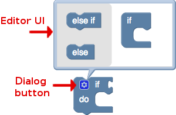
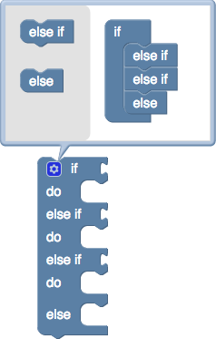
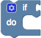

## 转换器

转换器是一个特殊的扩展。 除了更改块之外，它还定义了如何将那些更改保存到XML中以及如何从XML加载。 如果没有转换器扩展可能无法将更改保存到XML中或从XML加载更改。 Web上的转换器是使用在实例化时混合到块中的方法的集合以及用于用户配置变量的可选UI来实现的。 一个块可能只有一组转换器方法。

转换器最明显的示例是弹出对话框，该对话框允许if语句获取其他else if和else子句。 但并非所有转换器都如此复杂。

## 注册一个转换器

就像扩展名一样，必须在Blockly.Extensions中注册转换器。 Blockly库提供了一种方便的方法，可以对转换器进行基本验证并处理标准配置。

```js
Blockly.Extensions.registerMutator(name, mixinObj, opt_helperFn, opt_blockList);
```

* name：JSON中使用的转换器的字符串名称
* mixinObj：包含各种转换方法的对象
* opt_helperFn：可选的辅助函数，将在混合后在块上运行
* opt_blockList：与默认的mutator编辑UI一起使用的块的可选列表

## Mixin object

Web上的转换器只是在初始化期间混入块对象的一组方法。 至少，块上的转换器必须添加mutationToDom和domToMutation，它们指定如何序列化和反序列化转换器的状态。 使用默认更改器UI的转换器还必须实现分解和组合，以告诉UI如何将一个块分解为子块，以及如何从一组子块中更新转换。

mixin对象上的方法将添加到每个块实例中，因此可用于引用该块。

### mutationToDom 和 domToMutation

用于加载，保存，复制和粘贴块的XML格式会自动捕获并恢复存储在可编辑字段中的所有数据。 但是，如果该块包含其他信息，则在保存并重新加载该块时，该信息将丢失。 每个块的XML具有一个可选的mutator元素，可以在其中存储任意数据。

一个简单的例子: math.js的math_number_property块, 默认情况下，它具有一个输入：


如果下拉菜单更改为“可被...整除”，则会出现第二个输入：


使用下拉菜单上的更改处理程序可以轻松完成此操作。 问题是，当从XML创建此块（如在工具箱中显示，从工具箱中克隆，从已保存文件复制和粘贴，复制或加载）时，init函数将以其默认默认值构建该块- 输入形状。 如果XML指定其他一些块需要连接到不存在的输入，则会导致错误。

解决这个问题只需要在转换元素记录上写一个注释，说明该块有额外的输入：

```xml
<block type="math_number_property">
  <mutation divisor_input="true"></mutation>
  <field name="PROPERTY">DIVISIBLE_BY</field>
</block>
```

通过向mixinObj添加mutationToDom函数来保存转换数据。 这是math_number_property块中的示例：

```js
mutationToDom: function() {
  var container = document.createElement('mutation');
  var divisorInput = (this.getFieldValue('PROPERTY') == 'DIVISIBLE_BY');
  container.setAttribute('divisor_input', divisorInput);
  return container;
}
```

每当将块写入XML时，都会调用此函数。 如果该函数不存在或返回null，则不会记录任何转换。 如果函数存在并返回一个“ mutation” XML元素，则此元素（以及所有属性或子元素）将存储在块的XML表示的开头。

逆函数是domToMutation，每当从XML恢复块时都会调用domToMutation。 这是math_number_property块中的示例：

```js
domToMutation: function(xmlElement) {
  var hasDivisorInput = (xmlElement.getAttribute('divisor_input') == 'true');
  this.updateShape_(hasDivisorInput);  // Helper function for adding/removing 2nd input.
}
```

如果存在此函数，则将其传递给块的“变异” XML元素。 函数可以解析元素，然后根据元素的属性和子元素重新配置块。

### compose 和 decompose

转换对话框允许用户将一个块分解为较小的子块，然后重新配置它们，从而更改原始块的形状。 如果在mixinObj上同时定义了compose和decompose方法，则将对话框按钮和默认编辑UI添加到块中。 如果两者都未定义，则不会创建任何转换UI，但是事件或其他代码仍可能导致转换。 仅定义这两个功能之一是一个错误。



有关编辑UI的更多详细信息，请参见Mutator编辑UI。

打开更改程序对话框后，将调用该块的分解功能以填充更改程序的工作空间。

```js
decompose: function(workspace) {
  var topBlock = Blockly.Block.obtain(workspace, 'controls_if_if');
  topBlock.initSvg();
  ...
  return topBlock;
}
```

此函数至少必须为mutator对话框创建并初始化一个顶级块，然后将其返回。 此功能还应使用适当的任何子块填充此顶级块。

当更改程序对话框保存其内容时，将调用该块的compose函数，以根据新设置修改原始块。

```js
compose: function(topBlock) {
  ...
}
```

该函数从mutator的工作区传递给顶层块（由compose函数创建和返回的同一块）。 通常，此功能将搜寻附加到顶层块的子块，然后相应地更新原始块。



### saveConnections

理想情况下，即使对输入进行了重新排序，撰写功能也可以确保任何已经连接到原始块的块都保持连接到正确的输入。 为此，请在mixinObj上定义一个saveConnections方法：

```js
/**
 * Store pointers to any connected child blocks.
 * @param {!Blockly.Block} containerBlock Root block in mutator.
 * @this {Blockly.Block}
 */
saveConnections: function(containerBlock) {
  ...
}
```

如果定义了saveConnections，则转换器将在撰写之前调用它。

## Helper 函数

在混合器一起，转换器可以注册一个辅助函数。 该函数在实例化并添加mixinObj之后在该块上运行，可用于为转换器添加其他触发器或效果。

例如, math块中的math_is_divisibleby_mutator，它检查下拉列表并更新该块以具有正确的输入数。

```js
Blockly.Constants.Math.IS_DIVISIBLE_MUTATOR_EXTENSION = function() {
  this.getField('PROPERTY').setValidator(function(option) {
    var divisorInput = (option == 'DIVISIBLE_BY');
    this.sourceBlock_.updateShape_(divisorInput);
  });
};

Blockly.Extensions.registerMutator('math_is_divisibleby_mutator',
  Blockly.Constants.Math.IS_DIVISIBLEBY_MUTATOR_MIXIN,
  Blockly.Constants.Math.IS_DIVISIBLE_MUTATOR_EXTENSION);
```

## 转换器编辑页面

如果用户应该能够编辑块的形状，则转换器还需要一个UI。 添加此功能最简单的方法是在mixin中实现compose和decompose，并可选地提供要包含在默认编辑器中的块列表。

```js
Blockly.Extensions.registerMutator('controls_if_mutator',
  Blockly.Constants.Logic.CONTROLS_IF_MUTATOR_MIXIN, null,
  ['controls_if_elseif', 'controls_if_else']);
```

在这种情况下，Blockly将使用默认的mutator UI，并允许用户将controls_if_elseif和controls_if_else块添加到由decompose返回的堆栈中。


## 自定义用户界面编辑器

如果您的应用程序使用自定义转换器UI，则还可以使用opt_helperFn通过setMutator方法在块上设置自定义编辑器UI。

```js
// declare the helper function
var myMutatorFn = function() {
  // this will refer to the block
  this.setMutator(new MyMutator(...));
};
//...
// register the mutator along with the helper function
Blockly.Extensions.registerMutator('my_mutator', MY_MUTATOR_MIXIN,
  myMutatorFn, null);
```



setMutator函数采用一个参数，即新的Mutator。 Blockly使用的默认转换器在mutator.js中实现。