# Blockly开发者工具

[Blockly Developer Tools](https://blockly-demo.appspot.com/static/demos/blockfactory/index.html) 是一个基于Web的开发人员工具，可自动执行部分Blockly配置过程，包括创建自定义块，构建工具箱以及配置Web Blockly工作区。

使用该工具的Blockly开发人员流程包括三个部分：

* 使用Block Factory和Block Exporter创建自定义块
* 使用Workspace Factory构建工具箱和默认工作区
* 使用Workspace Factory配置工作区（当前是仅限Web的功能）

## Blokc Factory选项卡

“块工厂”选项卡可帮助您 为自定义块创建 块定义和 代码生成器。在此选项卡上，您可以轻松创建，修改和保存自定义块。

### 定义一个块

### 管理库

块由其名称引用，因此要创建的每个块必须具有唯一的名称。用户界面强制执行此操作，并在您“保存”新块或“更新”现有块时明确说明。

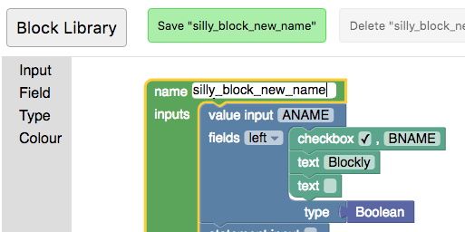
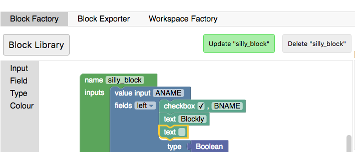

您可以在之前保存的块之间切换，也可以通过单击“库”按钮创建新的空块。更改现有块的名称是另一种快速创建具有相似定义的块的方法。

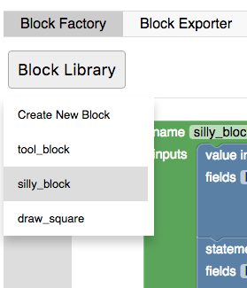

### 导出和导入库

块将保存到浏览器的本地存储中。清除浏览器的本地存储将删除您的块。要无限期保存块，必须下载库。您的块库将作为XML文件下载，可以导入该块以将块库设置为下载文件时的状态。请注意，导入块库会替换当前块，因此您可能希望先导出。

导入和导出功能也是维护和共享不同自定义块集的推荐方法。

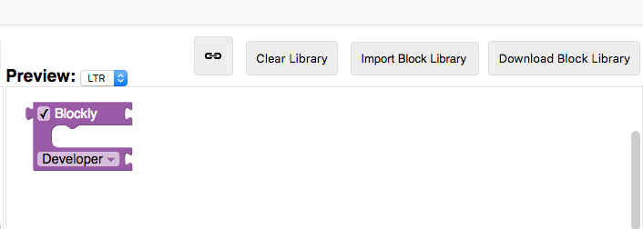

## Block导出器选项卡

设计块后，需要导出块定义和生成器存根，以便在应用程序中使用它们。这是在“块导出器”选项卡上完成的。

存储在块库中的每个块都将显示在块选择器中。单击块以选择或取消选择它以进行导出。如果要选择库中的所有块，请使用“选择”→“所有存储在块库”选项。如果使用“工作区工厂”选项卡构建工具箱或配置工作区，则还可以通过单击“选择”→“工作区工厂中的所有使用”来选择所用的所有块。

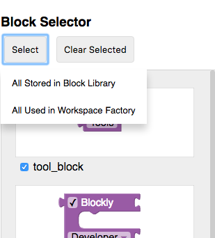

通过导出设置，您可以选择要定位的生成语言，以及是否需要所选块的定义，生成器存根或两者。选择这些后，单击“导出”以下载文件。

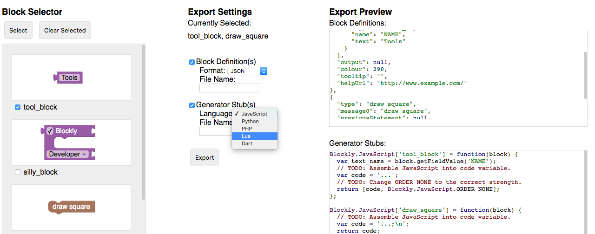

## Workspace Factory选项卡

Workspace Factory可以轻松配置工作区和工作区中的默认块集。您可以使用“工具箱”和“工作区”按钮在编辑工具箱和起始工作区之间切换。

### 构建工具箱

此选项卡有助于为工具箱构建XML。该材料假定您熟悉工具箱的功能。如果您已在此处编辑了要编辑的工具箱的XML，则可以通过单击“加载到编辑”来加载它。

### 没有类别的工具箱

如果您有几个块并且想要显示它们而没有任何类别，只需将它们拖到工作区中，您将看到预览中的工具箱中出现了块.

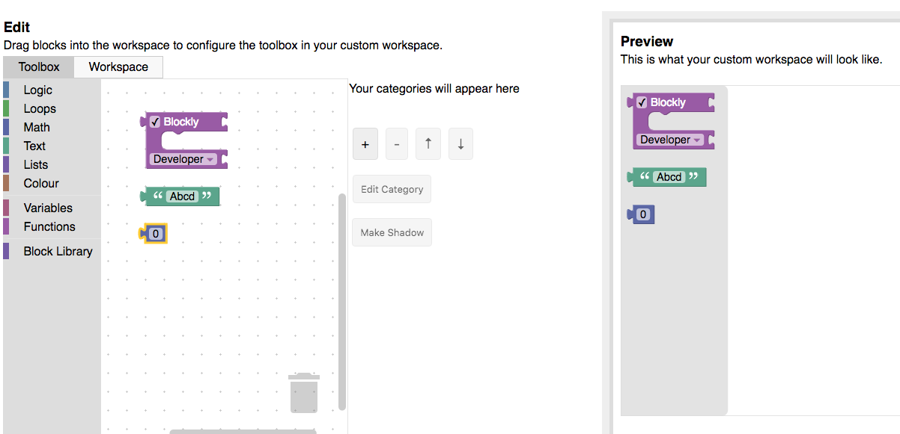

### 带有类别的工具箱

如果要在类别中显示块，请单击“+”按钮并选择新类别的下拉项。这会将类别添加到您可以选择和编辑的类别列表中。选择“标准类别”以添加单个标准块类别（逻辑，循环等）或“标准工具箱”以添加所有标准块类别。使用箭头按钮重新排序类别。

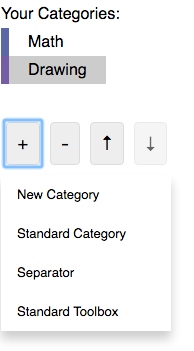

要更改所选类别的名称或颜色，请使用“编辑类别”下拉列表。将块拖动到工作区中会将其添加到所选类别。

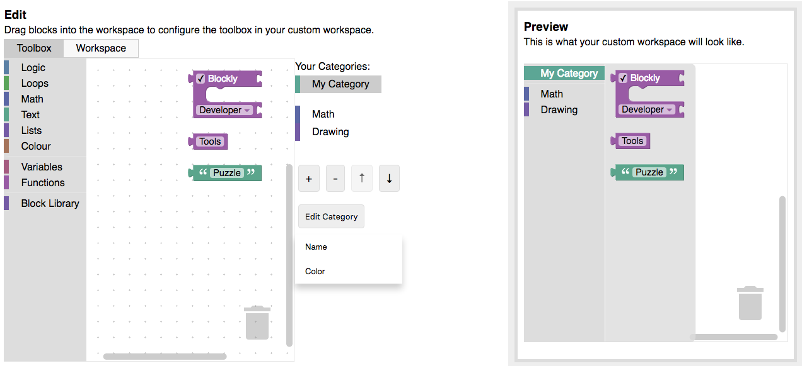

### 高级块
默认情况下，您可以将库中的任何标准块或任何块添加到工具箱中。如果您在JSON中定义了不在库中的块，则可以使用“导入自定义块”按钮导入它们。

某些块应该一起使用或包含默认值。这是通过 组和阴影完成的。在编辑器中连接的任何块都将作为一个组添加到工具箱中。通过选择子块并单击“制作阴影”按钮，也可以将附加到另一个块的块更改为阴影块。注意：只有不包含变量的子块可能会更改为阴影块。

如果在其工具箱中包含变量或功能块，请在工具箱中包含“变量”或“功能”类别，以允许用户充分利用该块。了解有关 “变量”或“功能”类别的更多信息。

### 配置工作区

要配置工作区的不同部分，请转到“工作区工厂”选项卡，然后选择“工作区”。

选择工作区选项
为配置选项设置不同的值， 并在预览区域中查看结果。启用 网格或 缩放功能可显示更多选项。此外，切换到使用类别通常需要更复杂的工作空间; 添加第一个类别时会自动添加垃圾桶和滚动条。

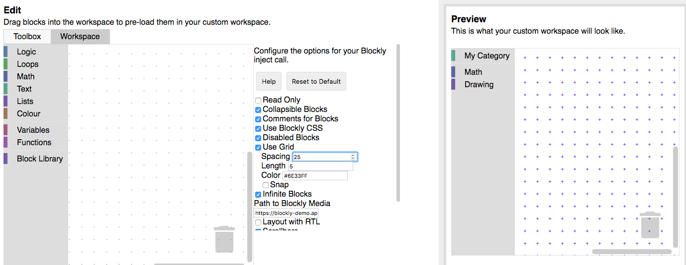

将预加载的块添加到工作区
这是可选的，但如果要在工作空间中显示一组块，则可能是必需的：

* 当应用程序加载时。
* 当触发事件（提升级别，单击帮助按钮等）时。

将块拖动到编辑空间中以在预览中的工作区中查看它们。您可以在选择块组时创建块组，禁用块以及创建某些块阴影块。

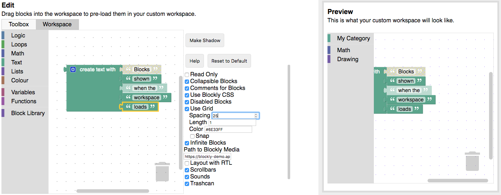

### 导出
Workspace Factory为您提供以下导出选项：

* 入门代码：生成启动html和javascript以注入您自定义的Blockly工作区。
* Toolbox生成XML以指定您的工具箱。
* 工作区块生成可以加载到工作区的XML。