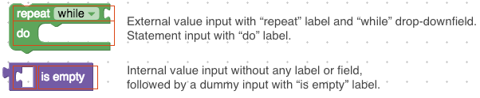
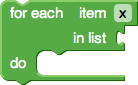
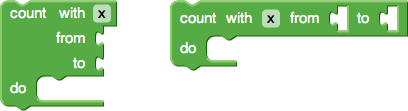

# 定义块

块定义描述块的外观和行为，包括文本，颜色，形状以及它可以连接的其他块。

定义自定义块后，每个平台都会以不同的方式加载这些定义，详细介绍了 Web和 Android特定的配置指南。

## JSON格式与JavaScript API
Blockly有两种定义块的方法：JSON对象和JavaScript函数。JSON格式是跨平台的，因此可以使用相同的代码在Web，Android和iOS上定义块。此外，JSON格式旨在简化开发具有不同单词排序的语言时的本地化过程。JSON格式是定义块的首选方法。

但是，JSON格式无法直接定义高级功能，如mutator或验证器。这些必须用平台的本机代码，JavaScript，Java或Swift编写，通常作为 扩展。

使用Blockly的原始JavaScript实现的应用程序也可以直接将块定义写入较低级别的Blockly API函数调用，如下面的各种JavaScript示例所示。

JSON格式：
```json
{
  "type": "string_length",
  "message0": 'length of %1',
  "args0": [
    {
      "type": "input_value",
      "name": "VALUE",
      "check": "String"
    }
  ],
  "output": "Number",
  "colour": 160,
  "tooltip": "Returns number of letters in the provided text.",
  "helpUrl": "http://www.w3schools.com/jsref/jsref_length_string.asp"
}
```

JAVASCRIPT格式：
```js
Blockly.Blocks['string_length'] = {
  init: function() {
    this.appendValueInput('VALUE')
        .setCheck('String')
        .appendField('length of');
    this.setOutput(true, 'Number');
    this.setColour(160);
    this.setTooltip('Returns number of letters in the provided text.');
    this.setHelpUrl('http://www.w3schools.com/jsref/jsref_length_string.asp');
  }
};
//该init函数创建块的形状。在此函数的上下文中，关键字this是正在创建的实际块。
```

两个示例都加载相同的'string_length'块。


在Web上，使用该initJson函数加载JSON格式。这也允许在Blockly网页中混合使用这两种格式。最好尽可能使用JSON定义块，并仅将JavaScript用于JSON不支持的块定义部分。

下面是一个主要使用JSON定义的块的示例，但是使用JavaScript API进行扩展以提供动态工具提示。

```js
var mathChangeJson = {
  "message0": "change %1 by %2",
  "args0": [
    {"type": "field_variable", "name": "VAR", "variable": "item", "variableTypes": [""]},
    {"type": "input_value", "name": "DELTA", "check": "Number"}
  ],
  "previousStatement": null,
  "nextStatement": null,
  "colour": 230
};

Blockly.Blocks['math_change'] = {
  init: function() {
    this.jsonInit(mathChangeJson);
    // Assign 'this' to a variable for use in the tooltip closure below.
    var thisBlock = this;
    this.setTooltip(function() {
      return 'Add a number to variable "%1".'.replace('%1',
          thisBlock.getFieldValue('VAR'));
    });
  }
};
```

## 块颜色

块的主要颜色由JSON colour属性， block.setColour(..)函数或使用主题定义块样式定义。

```json
{
  // ...,
  "colour": 160,
}
```
```js
init: function() {
  // ...
  this.setColour(160);
}
```

## 声明连接

用户可以使用nextStatement和 previousStatement连接器创建块序列。在Blockly的标准布局中，这些连接位于顶部和底部，并且块垂直堆叠。

具有前置连接器的块不能具有输出连接器，反之亦然。术语语句块指的是没有值输出的块。语句块通常具有前置连接和后续连接。

nextStatement并且previousStatement可以键入连接 ，但标准块不使用此功能。

### 后续连接
在块的底部创建一个接口，以便其他语句可以堆叠在它下面。具有后续连接但没有前置连接的块通常表示事件，并且可以配置为使用帽子进行渲染 。


```json

{
  ...,
  "nextStatement": null,
}

{
  "nextStatement": "Action",
  ...
}
```
```js
//无类型：
this.setNextStatement(true);  // false implies no next connector, the default

//键入（罕见）：
this.setNextStatement(true, 'Action');
```

### 前置连接

在块的顶部创建一个凹口，以便它可以作为一堆语句连接。

具有前置连接的块不能具有输出连接。


```json
无类型：
{
  ...,
  "previousStatement": null,
}

键入（罕见）：
{
  "previousStatement": "Action",
  ...
}
```
```js
//无类型：
this.setPreviousStatement(true);  // false implies no previous connector, the default

//键入（罕见）：
this.setPreviousStatement(true, 'Action');
```

## 块输出

块可以具有单个输出，表示为前缘上的公拼图连接器。输出连接到值输入。具有输出的块通常称为值块。


```json
无类型：
{
  // ...,
  "output": null,
}

类型：
{
  // ...,
  "output": "Number",
}
```
```js
//无类型：
init: function() {
  // ...
  this.setOutput(true);
}

//类型：
init: function() {
  // ...
  this.setOutput(true, 'Number');
}
```

具有输出连接器的块也不能具有先前的语句缺口。

## 块输入

块具有一个或多个输入，其中每个输入是可以在连接中结束的标签和字段序列。有三种类型的输入，匹配连接类型：

* 值输入：连接到一个输出连接一个的 值块。阿math_arithmetic块（加法，减法）是具有两个值输入一个块的一个例子。
* 声明输入：连接到 先前连接一个的语句块。while循环的嵌套部分是语句输入的示例。
* 虚拟输入：没有块连接。当块配置为使用外部值输入时，类似于换行符。



JSON格式和JavaScript API使用略有不同的模型来描述其输入。

### JSON中的输入和字段

JSON定义块被构造为插消息字符串的序列（message0，message1，...），其中每一内插标记（%1，%2，...）是一个字段或一输入端（因此在输入连接器呈现，消息内）在匹配的JSON argsN数组中。此格式旨在简化国际化。

```json
{
  "message0": "set %1 to %2",
  "args0": [
    {
      "type": "field_variable",
      "name": "VAR",
      "variable": "item",
      "variableTypes": [""]
    },
    {
      "type": "input_value",
      "name": "VALUE"
    }
  ]
}
```


插值令牌必须args0完全匹配数组：没有重复，没有遗漏。令牌可以以任何顺序存在，这允许不同的语言改变块的布局。

插值标记两侧的文本是空白修剪的。使用该字符的文本%（例如，在引用百分比时）应该使用， %%以便它不被解释为插值标记。

参数的顺序和参数类型定义块的形状。更改其中一个字符串可以完全更改块的布局。这在具有与英语不同的单词顺序的语言中尤为重要。考虑一种假设的语言，其中"set %1 to %2"（如上例所示）需要反过来说"put %2 in %1"。更改此一个字符串（并保持JSON的其余部分不变）将导致以下块：


Blockly自动更改字段的顺序，创建虚拟输入，并从外部输入切换到内部输入。

1. ARGS
    每个消息字符串与args相同数字的数组配对。例如，message0顺其自在args0。插值标记（%1,, %2......）指的是args数组的项目。每个对象都有一个 type字符串。其余参数因类型而异：

    * 领域：
        * field_input
        * field_dropdown
        * field_checkbox
        * field_colour
        * field_number
        * field_angle
        * field_variable
        * field_date
        * field_label
        * field_image.
    * 输入：
        * input_value
        * input_statement
        * input_dummy

    每个对象也可能有一个alt字段。在Blockly无法识别对象的情况下type，则alt在该位置使用该对象。例如，如果将一个名为new的字段field_time添加到Blockly，则使用此字段的块可用于为旧版本的Blockly alt定义field_input回退：

    ```json
    {
    "message0": "sound alarm at %1",
    "args0": [
        {
        "type": "field_time",
        "name": "TEMPO",
        "hour": 9,
        "minutes": 0,
        "alt":
            {
            "type": "field_input",
            "name": "TEMPOTEXT",
            "text": "9:00"
            }
        }
    ]
    }
    ```

    一个alt对象可以有自己的alt对象，从而允许链接。最终，如果Blockly无法在args0数组中创建对象（在尝试任何alt对象之后），则只需跳过该对象。

    如果message字符串以文本或输入未包含的字段结尾，则虚拟输入将自动添加到块的末尾 。因此，如果块上的最后一个输入是虚拟输入，那么它可以从args数组中省略，并且不需要插值message。自动添加拖尾虚拟输入允许转换器更改 message而无需修改其余的JSON。请参阅本页前面的"set %1 to %2"（无虚拟输入）和"put %2 in %1"（虚拟输入添加）示例 。

2. lastDummyAlign0

    在极少数情况下，自动创建的尾随虚拟输入需要与"RIGHT"或对齐"CENTRE"。如果未指定，则为默认值"LEFT"。

    在下面的例子message0是"send email to %1 subject %2 secure %3" 和Blockly自动添加用于第三行的伪输入。设置 lastDummyAlign0为"RIGHT"强制此行右对齐。

    

    在设计RTL（阿拉伯语和希伯来语）块时，左右颠倒。因此"RIGHT"会将字段对齐到左侧。

3. message1, args1, lastDummyAlign1

    一些块自然地分成两个或更多个单独的部分。考虑这个有两行的重复块：

    

    如果使用单个消息描述此块，则message0属性为"repeat %1 times %2 do %3"。这个字符串对于翻译来说很尴尬，很难解释%2替换意味着什么。该%2虚拟输入也不会甚至在一些语言需要的。并且可能有多个块希望共享第二行的文本。更好的方法是让JSON使用多个消息和args属性：

    ```json
    {
    "type": "controls_repeat_ext",
    "message0": "repeat %1 times",
    "args0": [
        {"type": "input_value", "name": "TIMES", "check": "Number"}
    ],
    "message1": "do %1",
    "args1": [
        {"type": "input_statement", "name": "DO"}
    ],
    "previousStatement": null,
    "nextStatement": null,
    "colour": 120
    }
    ```

    可以以JSON格式定义任意数量的message，args和lastDummyAlign属性，从0开始并按顺序递增。请注意，块工厂无法将消息拆分为多个部分，但手动执行此操作非常简单。

### JavaScript中的输入和字段

JavaScript API包含append每种输入类型的方法：
```js
this.appendDummyInput()
    .appendField('for each')
    .appendField('item')
    .appendField(new Blockly.FieldVariable());
this.appendValueInput('LIST')
    .setCheck('Array')
    .setAlign(Blockly.ALIGN_RIGHT)
    .appendField('in list');
this.appendStatementInput('DO')
    .appendField('do');
```



每个方法都可以使用代码生成器使用的标识符字符串。虚拟输入很少需要引用，标识符通常不设置。

如上所示，每个方法都通过方法链返回输入对象以进行配置。有三个功能用于配置输入。

1. setCheck

    ```js
    input.setCheck('Number');
    ```
    此可选功能用于连接输入的类型检查。如果给定参数null（默认值），则此输入可以连接到任何块。有关详细信息，请参阅《4.11类型检查》。

2. setAlign

    ```js
    input.setAlign(Blockly.ALIGN_RIGHT);
    ```
    此可选功能用于对齐字段（见下文）。存在可以作为参数传递给该功能被传入三个自描述值： Blockly.ALIGN_LEFT，Blockly.ALIGN_RIGHT，和Blockly.ALIGN_CENTRE。注意英国拼写的“中心”。左对齐是默认值。

    在设计RTL（阿拉伯语和希伯来语）块时，左右颠倒。因此Blockly.ALIGN_RIGHT会将字段对齐到左侧。

3. appendField

    一旦创建了输入并将其附加到块appendInput，可以选择将任意数量的字段附加到输入。这些字段通常用作标签来描述每个输入的用途。

    ```js
    input.appendField('hello');
    ```
    

    最简单的字段元素是文本。Blockly的惯例是使用所有小写文本，但专有名称除外（例如Google，SQL）。

    输入行可以包含任意数量的字段元素。appendField 可以将多个调用链接在一起以有效地将多个字段添加到同一输入行。

    ```js
    input.appendField('hello')
         .appendField(new Blockly.FieldLabel('Neil', 'person'));
    ```
    

    该appendField('hello')调用实际上是使用显式FieldLabel构造函数的快捷方式：appendField(new Blockly.FieldLabel('hello'))。人们希望使用构造函数的唯一时间是指定类名，以便可以使用CSS规则对文本进行样式设置。

### 内联与外部

块输入可以呈现为外部或内部。



块定义可以指定一个可选的布尔值，控制输入是否为内联。如果false那么任何值输入将是外部的（例如左侧块）。如果true那么任何值输入将是内联的（例如上面的右侧块）。

```json
{
  // ...,
  "inputsInline": true
}
```
```js
init: function() {
  // ...
  this.setInputsInline(true);
}
```

如果没有定义，则Blockly将使用一些启发式方法来猜测哪种模式最佳。假设Blockly做出了正确的选择，将此字段保留为undefined是首选，因为不同的语言翻译可以自动具有不同的模式。请参阅本页前面的"set %1 to %2"（外部输入）和 "put %2 in %1"（内联输入）的JSON示例。

当块可能具有诸如数字的小输入时，使用内联输入。如果collapse 启用了配置，则用户可以通过上下文菜单切换此选项（如果工具箱具有类别，则默认为true）。

## 字段

字段定义块中的UI元素。这些包括字符串标签，图像和文字数据的输入， 如字符串和数字。最简单的例子是math_number块，可以是field_input（web）或field_number（Android）来键入数字。


Blockly提供了许多内置字段，包括文本输入，颜色选择器和图像。您还可以创建自己的字段,详情参阅《4.14字段》

## 提示

当用户将鼠标悬停在块上时，工具提示提供即时帮助。如果文本很长，它将自动换行。

```json
{
  // ...,
  "tooltip": "Tooltip text."
}
```
```js
init: function() {
  this.setTooltip("Tooltip text.");
}
```

在JavaScript API中，工具提示也可以定义为函数而不是静态字符串。这允许动态帮助。请参阅有关math_arithmetic工具提示的示例，该工具提示会根据选择的下拉选项而更改。

```js
Blockly.Blocks['math_arithmetic'] = {
  init: function() {
    // ...

    // Assign 'this' to a variable for use in the tooltip closure below.
    var thisBlock = this;
    this.setTooltip(function() {
      var mode = thisBlock.getFieldValue('OP');
      var TOOLTIPS = {
        'ADD': Blockly.Msg.MATH_ARITHMETIC_TOOLTIP_ADD,
        'MINUS': Blockly.Msg.MATH_ARITHMETIC_TOOLTIP_MINUS,
        'MULTIPLY': Blockly.Msg.MATH_ARITHMETIC_TOOLTIP_MULTIPLY,
        'DIVIDE': Blockly.Msg.MATH_ARITHMETIC_TOOLTIP_DIVIDE,
        'POWER': Blockly.Msg.MATH_ARITHMETIC_TOOLTIP_POWER
      };
      return TOOLTIPS[mode];
    });
  }
};
```

使用JavaScript API，块可以指定一个函数，而不是静态字符串，它返回工具提示字符串。这允许动态工具提示。请参阅math_arithmetic示例。

## 帮助网址

块可以有一个与之关联的帮助页面。通过右键单击块并从上下文菜单中选择“帮助”，可以向Blockly for Web的用户使用此选项。如果此值为则null则菜单将显示为灰色。

```json
{
  // ...,
  "helpUrl": "https://en.wikipedia.org/wiki/For_loop"
}
```
```js
init: function() {
  // ...
  this.setHelpUrl('https://en.wikipedia.org/wiki/For_loop');
}
```

使用JavaScript API，块可以指定一个函数，而不是静态字符串，它返回一个URL字符串，从而允许动态帮助。

## 更改监听器和验证器

块可以具有更改侦听器函数，这些函数在对工作空间的任何更改时调用（包括与块无关的那些）。这些主要用于设置块的警告文本或工作区外的类似用户通知。

通过使用函数调用setOnChange来添加该函数，如果您计划在所有平台上使用它，则可以在init期间或通过JSON扩展来完成。

```json
{
  // ...,
  "extensions":["warning_on_change"],
}

Blockly.Extensions.register('warning_on_change', function() {
  // Example validation upon block change:
  this.setOnChange(function(changeEvent) {
    if (this.getInput('NUM').connection.targetBlock()) {
      this.setWarningText(null);
    } else {
      this.setWarningText('Must have an input block.');
    }
  });
});
```
```js
Blockly.Blocks['block_type'] = {
  init: function() {
    // Example validation upon block change:
    this.setOnChange(function(changeEvent) {
      if (this.getInput('NUM').connection.targetBlock()) {
        this.setWarningText(null);
      } else {
        this.setWarningText('Must have an input block.');
      }
    });
  }
}
```

系统调用该函数，传入change事件。函数内部this是指块实例。

因为在任何更改时调用该函数，如果使用，开发人员应确保侦听器快速运行。人们也应该警惕可能级联或循环回监听器的工作空间的更改。

见controls_flow_statements，logic_compare和procedures_ifreturn 为实例块。

请注意，可编辑字段具有自己的事件侦听器，用于输入验证可能会导致副作用。

## 赋值函数
Mutators允许高级块改变形状，最显着的是由于用户打开一个对话框来添加，删除或重新排列组件。可以通过JSON使用mutator密钥添加Mutators 。

```json
{
  // ...,
  "mutator":"if_else_mutator"
}
```

## 每块配置

块实例具有许多属性，用于配置它们对用户的行为方式。这些可以用于约束工作空间以反映域的某些属性（例如，恰好有一个'开始'事件），或者集中用户的努力（例如，教程）。

### 可删除状态

默认情况下，用户可以删除可编辑工作区上的任何块（不是 readOnly）。有时，使某些块永久固定装置是有用的。例如，教程框架代码。

```
block.setDeletable(false);
```
任何块，包括标记为不可删除的块，都可以通过编程方式删除：

```
block.dispose();
```

### 可编辑状态

```
block.setEditable(false);  

```
设置为false时，用户将无法更改块的字段（例如，下拉列表和文本输入）。块在可编辑工作区上默认为可编辑。

### 可动状态

```
block.setMovable(false); 
```

设置为false时，用户将无法直接移动块。作为另一个块的子节点的不可移动块可能不会与该块断开连接，但如果移动父节点，它将与其父节点一起移动。

块默认为可在可编辑工作区上移动。

任何块（甚至是不可移动的块）一旦在工作空间中就可以以编程方式移动。在JavaScript中，调用block.moveBy(dx, dy)。除非另行指定，否则工作空间上块的起始位置默认为（0,0）。

### Block数据
```
this.data = '16dcb3a4-bd39-11e4-8dfc-aa07a5b093db';  // Web only
```

数据是附加到块的可选和任意字符串。当保存为XML时，数据字符串存储在<data></data>标记中，以便可以将其往返回到块。使用数据字符串将块与外部资源相关联或用于任何其他自定义目的。

请注意，如果块复制或复制/粘贴，则数据字符串也会重复。不可删除的块无法复制或复制/粘贴。