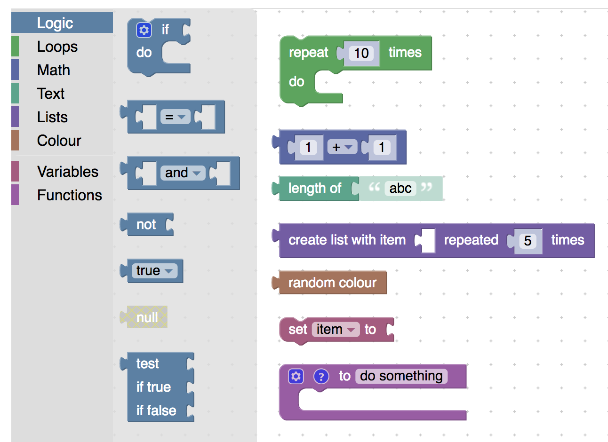
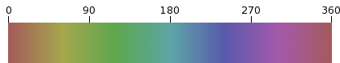
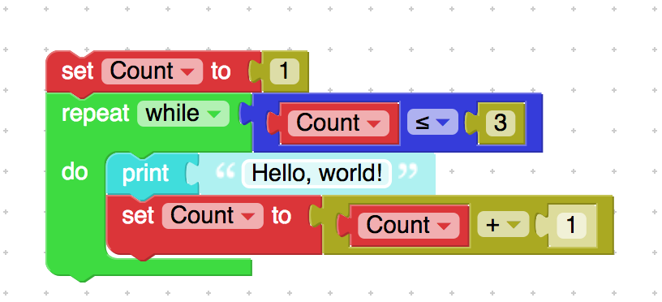

# 块颜色

大多数Blockly应用程序使用各种块颜色可视化地将块分组。Blockly附带的块包括八个类别，颜色由演示中的各种工具栏类别镜像：



多工具箱条目还包括 阴影块作为默认输入值。例如，蓝色加法块的编号。阴影块的颜色来自块的标准颜色，但是去饱和。

## 定义块颜色

块颜色可以用JSON或JavaScript表示法定义：

```json
{
  // ...,
  "colour": 160,
}
```
```js
init: function() {
  // ...
  this.setColour(160);
}
```

请注意英式英语（colour）的拼写。未能设置颜色会导致黑色块。

该colour值可以采用多种形式之一。最简单的是0-360之间的数字，在色调饱和度值（HSV）颜色模型中定义块的色调 。



使用具有饱和度的HSV和针对所有块颜色固定的值，您可以轻松选择块颜色，同时确保所有块共享一个内聚调色板。

几个颜色选择器提供HSV颜色空间，例如 HSV选择器。输入Blockly的饱和度和值常量（默认值分别为45％和65％），然后根据需要滑动色调。使用此色调编号作为 colour值（JSON）或this.setColour(..)函数的参数（JavaScript）。

通过覆盖以下Blockly常量，可以为每个应用程序调整饱和度和值：

```js
Blockly.HSV_SATURATION // 0 (inclusive) to 1 (exclusive), defaulting to 0.45
Blockly.HSV_VALUE // 0 (inclusive) to 1 (exclusive), defaulting to 0.65
```

## 颜色参考

通常，多个块共享相同的颜色，集中颜色定义简化了颜色管理并添加了正确颜色的新块。块颜色可以使用 字符串表引用 来完成。

Blockly包含字符串表中的九个颜色常量，对应于工具箱类别，以及动态变量的不同颜色：

```js
'%{BKY_LOGIC_HUE}'
'%{BKY_LOOPS_HUE}'
'%{BKY_MATH_HUE}'
'%{BKY_TEXTS_HUE}'
'%{BKY_LISTS_HUE}'
'%{BKY_COLOUR_HUE}'
'%{BKY_VARIABLES_HUE}'
'%{BKY_VARIABLES_DYNAMIC_HUE}'
'%{BKY_PROCEDURES_HUE}'
```

这些字符串值可以在JSON定义和 block.setColour(..)。

您可以通过添加到Blockly.Msg以下内容来添加自己的颜色常量：

```js
// Define the colour
Blockly.Msg.EVERYTHING_HUE = 42;
// Use in a block or block definition:
block.setColour('%{BKY_EVERYTHING_HUE}');
```

将颜色存储在本地化字符串表中可能看起来很不寻常，但考虑到JSON符号已经支持引用，它很方便。如果需要，它还允许使用本地颜色。

工具箱XML还支持类别颜色属性中的此类颜色引用：

```html
<category name="Logic" colour="%{BKY_LOGIC_HUE}">
  ...
</category>
```

## 自定义饱和度和值

```js
Blockly.HSV_SATURATION // 0 (inclusive) to 1 (exclusive), defaulting to 0.45
Blockly.HSV_VALUE // 0 (inclusive) to 1 (exclusive), defaulting to 0.65
```

## 十六进制表示的颜色值

强烈建议使用HSV色域，但Blockly支持指定为#RRGGBB十六进制的块颜色。虽然这可以促进与其他应用程序颜色（例如CSS中的样式）和设计应用程序（例如，Photoshop）的协调，但如果不仔细选择，则设计风险很容易导致不协调的块。



除非您拥有专门的视觉设计资源，否则建议在HSV色彩空间的限制范围内工作。如果尝试以这种方式重新定义所有颜色，请考虑 Google的Material Design资源颜色。

## 可访问性问题

Blockly使用颜色作为每个块的作用的强烈暗示，并将块组合在一起。对于包含的块，此可供性是次要的块上的文本，因此不是关键属性。但是，在选择块调色板时，应考虑色盲。

虽然Blockly没有对色盲住宿的具体支持，但[此页面](http://mkweb.bcgsc.ca/colorblind/)包括示例7,12 和15调色板，这些调色板试图最大限度地区分最常见的色盲形式。请注意，这不会映射到Blockly中的7,12或15个块类别，因为应为阴影块和字段保留一些阴影。