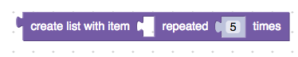
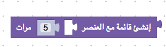

# 本地化块

Blockly支持可以本地化为用户语言的块定义。通过使用字符串表，JSON块定义中的消息字符串可以调整输入，字段和标签，以反映语言的词汇，单词排序和方向。






所有这些情况都共享相同的JSON块定义：

```json
// Block for creating a list with one element repeated.
{
  "type": "lists_repeat",
  "message0": "%{BKY_LISTS_REPEAT_TITLE}",
  "args0": [
    {
      "type": "input_value",
      "name": "ITEM"
    },
    {
      "type": "input_value",
      "name": "NUM",
      "check": "Number"
    }
  ],
  "output": "Array",
  "colour": "%{BKY_LISTS_HUE}",
  "tooltip": "%{BKY_LISTS_REPEAT_TOOLTIP}",
  "helpUrl": "%{BKY_LISTS_REPEAT_HELPURL}"
}
```

## 字符串表

该lists_repeat示例包括几个"%{BKY_...}"字符串。其中每个都是对Blockly.Msg字符串表中字符串的引用。当块被实例化时，Blockly尝试用该值替换该字符串。

例如，如果存在，%{BKY_LISTS_REPEAT_TITLE}则替换为值 Blockly.Msg['LISTS_REPEAT_TITLE']。如果该值不存在，则%{BKY_...}表示法将保留在原位，并且Blockly会针对缺失的翻译发出警告。

如示例所示，符号在多个位置有效。消息和工具提示允许替换用户可见的字符串。同样，下拉字段也可以使用项目文本的表示法。可以对帮助URL进行本地化，以确保将用户定向到类似的本地化页面。最后，该 colour值可以使用符号来帮助集中块的调色板。

如果您正在使用JavaScript实现并且不希望在运行时更改用户语言，您可能会发现使用直接引用更容易。例如，Blockly.Msg['LISTS_REPEAT_TITLE']或者 Blockly.Msg.LISTS_REPEAT_TITLE'。由于这不是有效的JSON，因此这种语法（引用其他地方声明的变量）不适用于Android或iOS

字符串表通过任何一个特定.js于语言的文件 加载msg/js。将相应的文件加载到您的网页中以加载正确的块转换。Blockly for iOS运行略有不同，自动从本地化消息中选择正确的JSON文件 。

## JSON消息插入

message0、message1、message2 等属性是用于其中信息的标签文本。对于列表_重复块中的 LISTS_REPEAT_TITLE，英语值为：Blockly.Msg.LISTS_REPEAT_TITLE = 'create list with item %1 repeated %2 times';
两个插值标记 %1 和 %2 标记两个输入的位置。更多详细信息在 args0 数组中提供。args1 标记相应 %message1 字符串。有关指定块输入和字段的更多详细信息，请参阅4.3。

插值标记之间的文本将转换为未命名的/blockly/reference/js/Blockly.FieldLabel。这将创建块的单词顺序及其读取方式：

```js
// In Spanish
Blockly.Msg.LISTS_REPEAT_TITLE = "crear lista con el elemento %1 repetido %2 veces";
// In Korean
Blockly.Msg.LISTS_REPEAT_TITLE = "%1을 %2번 넣어, 리스트 생성";
```

从右到左语言翻译时，消息字符串以可视顺序编写，并且不应包含Unicode方向命令：

```js
// In Arabic. Note how %2 is left of %1, since it read right to left.
Blockly.Msg.LISTS_REPEAT_TITLE = "إنشئ قائمة مع العنصر  %1 %2 مرات";
```

## 重建字符串表

构建字符串表的“.js”文件是build.py脚本的一部分。该脚本使用msg / messages.js中的标识符键和英文翻译来创建新的en.json。然后，结合其他JSON文件中找到的所有翻译，它将为所有语言（包括新的en.js）重新创建更新的JavaScript字符串表。非英语JSON文件来自TranslateWiki的合作伙伴。有关如何提供帮助的详细信息，请参见翻译说明。