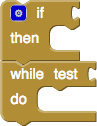
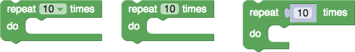
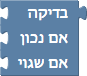
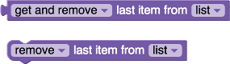
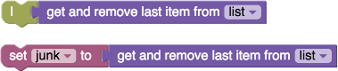
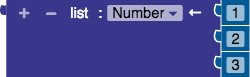
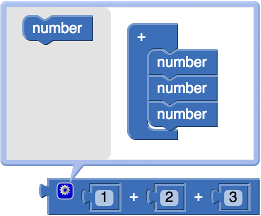

# 自定义块：样式指南

多年来，Blockly和Blockly Games团队已经吸取了许多教训，这些教训适用于开发新积木的人。以下是我们犯过的错误或其他人常见的错误的集合。

这些是我们使用Blockly的视觉样式学到的一般课程，可能并不适用于所有用例或设计。存在其他解决方案。这也不是用户可能遇到的问题以及如何避免它们的详尽列表。每种情况都有点不同，并且各有其取舍。

## 1.条件循环与循环

新用户最困难的障碍是条件和循环。许多基于块的环境将这两个块都分组为相同的“控件”类别，并且两个块具有相同的形状和颜色。当新用户混淆这两个模块时，这通常会导致沮丧。Blockly建议将条件和循环移动到单独的“逻辑”和“循环”类别中，每种类别使用不同的颜色。这清楚地表明，尽管它们具有相似的形状，但它们是行为不同的独特想法。

建议：将条件和循环分开。



## 2.基于列表

新手程序员在第一次遇到基于零的列表时会做出不良反应。结果，Blockly通过将列表和字符串索引设为一个基础来跟随Lua和Lambda Moo的领导。

为了更高级地使用Blockly，支持从零开始的列表，以使过渡到文本更加容易。对于年轻或更多的新手受众，仍建议使用基于索引的索引。

建议：一个是第一个数字。


## 3.用户输入



有三种从用户那里获取参数的方法。下拉菜单是限制性最强的，适合简单的教程和练习。输入字段可提供更大的自由度，并且适合进行更多的创造性活动。值块输入（通常带有阴影块）提供了计算值（例如随机生成器）的机会，而不仅仅是静态值。

建议：选择一种适合您的用户的输入法。

## 4.实时块图像

块的文档应包括它所引用的块的图像。截屏很容易。但是，如果有50张这样的图像，并且将应用程序翻译成50种语言，则突然有一个正在维护2500张静态图像。然后，配色方案改变了，需要重新更新2500张图像。

为了摆脱维护噩梦，Blockly Games将所有屏幕截图替换为以只读模式运行的Blockly实例。结果看起来与图片相同，但是可以保证是最新的。只读模式使国际化成为可能。

建议：如果您支持多种语言，请使用只读模式。



## 5.你的另一个左

美国儿童的反馈（尽管有趣的是，其他国家的反馈却未显示）表明，左右之间普遍存在混乱。这通过添加箭头来解决。如果方向是相对的（例如，相对于化身），则箭头的样式很重要。当化身朝向相反方向时，→直箭头或↱转向箭头会造成混淆。最有用的是⟳圆形箭头，即使旋转角度小于箭头指示的情况。

建议：尽可能用Unicode图标补充文本。


## 6.高级块

即使可能降低执行性能或灵活性，也应尽可能采用更高级别的方法。考虑以下Apps脚本表达式：

```js
SpreadsheetApp.getActiveSheet().getDataRange().getValues()
```

在保留所有潜在功能的1：1映射下，将使用四个块构建以上表达式。但是Blockly的目标是更高的层次，并会提供一个块来封装整个表达式。目标是针对95％的情况进行优化，即使这会使其余5％的难度增加。Blockly并不是要替代基于文本的语言，而是要帮助用户克服最初的学习过程，以便他们可以使用基于文本的语言。

建议：不要盲目地将整个API转换为块。

## 7.可选的返回值

基于文本的编程中的许多函数执行一个动作，然后返回一个值。此返回值可以使用也可以不使用。一个例子是堆栈的 pop()功能。可能会调用Pop来获取和删除最后一个元素，或者可能会调用Pop来删除最后一个具有返回值被忽略的元素。

```js
var last = stack.pop();  // Get and remove last element.
stack.pop();  // Just remove last element.
```

基于块的语言通常不擅长忽略返回值。值块必须插入接受该值的东西。有几种策略可以解决这个问题。

    a）绕开问题。大多数基于块的语言都设计了避免这种情况的语言。例如，Scratch没有任何具有副作用和返回值的块。

    b）提供两个块。如果工具箱中的空间不是问题，则一种简单的解决方案是为每种类型的块提供两个，一个带返回值，一个不带返回值。不利的一面是，这可能导致包含许多几乎相同的模块的混乱的工具箱。


    c）突变一个区块。使用下拉菜单，复选框或其他控件，允许用户选择是否有返回值。块然后根据其选项更改形状。在Blockly的列表访问块中可以看到一个示例。



    d）吃掉价值。App Inventor的第一个版本创建了一个特殊的管道块，可以使用任何连接的值。用户不理解该概念，因此App Inventor的第二个版本删除了管道块，而是建议用户简单地将值分配给一次性变量。



建议：每种策略各有利弊，请选择适合您的用户的策略。

## 8.生长块

某些块可能需要可变数量的输入。示例是一个加法运算块，它对任意一组数字求和，或者一个if / elseif / else运算块与任意一组elseif子句，或者一个列表构造函数，具有任意数量的初始化元素。有几种策略，每种策略都有其优点和缺点。

1. 最简单的方法是使用户用较小的块组成块。一个示例是通过嵌套两个两位数加法块来添加三个数字。另一个示例是仅提供if / else块，并使用户嵌套它们以创建elseif条件。

这种方法的优点是其最初的简便性（对于用户和开发人员而言）。缺点是，在有大量嵌套的情况下，代码变得非常笨拙，并且用户难以阅读和维护。

2. 一种替代方法是动态扩展该块，以便最后始终有一个空闲输入。同样，如果末尾有两个空闲输入，则该块会删除最后一个输入。这是App Inventor的第一个版本使用的方法。

由于一些原因，App Inventor的用户不喜欢自动增长的块。首先，总是有免费的输入，程序永远不会“完成”。其次，在堆栈中间插入一个元素令人沮丧，因为这涉及到断开编辑下面的所有元素并重新连接它们。就是说，如果顺序不重要，并且可以让用户对程序中的漏洞感到满意，那么这是一个非常方便的选择。

3. 为了解决孔的问题，一些开发人员将+/-按钮添加到手动添加或删除输入的块中。打开Roberta使用两个这样的按钮从底部添加或删除输入。其他开发人员在每行添加两个按钮，以便可以容纳从堆栈中间插入和删除操作。其他人在每行添加两个向上/向下按钮，以便可以适应堆栈的重新排序。

此策略的选择范围很广，从每个块仅两个按钮到每行四个按钮。一方面存在用户无法执行所需动作的危险，另一方面，UI充满了按钮，看起来像是星际飞船Enterprise的桥梁。

4. 最灵活的方法是在块中添加变异体气泡。这被表示为一个单个按钮，用于打开该块的配置对话框。元素可以随意添加，删除或重新排列。

这种方法的缺点是对于新手来说，它的变异子不直观。引入mutators需要某种形式的指导。针对小孩子的基于块的应用程序不应使用变异器。尽管了解到了它们，但它们对于高级用户而言是无价的。

建议：每种策略各有利弊，请选择适合您的用户的策略。

## 9.干净的代码生成

Advanced Blockly用户应该能够查看生成的代码（JavaScript，Python，PHP，Lua，Dart等），并立即识别他们编写的程序。这意味着需要付出额外的努力来保持该机器生成的代码可读。多余的括号，数字变量，压缩的空格和冗长的代码模板都阻碍了生成优雅代码的方式。生成的代码应包含注释，并应符合 Google的样式指南。

建议：为您生成的代码感到自豪。向用户显示。

## 10.语言依赖性

对干净代码的渴望的副作用是，Blockly的行为很大程度上取决于交叉编译语言的行为方式。最常见的输出语言是JavaScript，但是如果将Blockly交叉编译为另一种语言，则不应进行不合理的尝试来保留两种语言之间的确切行为。例如，在JavaScript中，空字符串为false，而在Lua中为true。为Blockly的代码定义单一的行为模式以执行，无论目标语言是什么，都将导致看起来像是从GWT编译器出来的难以维护的代码。

建议：块不是语言，请允许现有的语言影响行为。