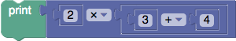

# 运算符优先级

代码生成器用于将Blockly的程序转换为JavaScript，Python，PHP，Lua，Dart等。在为新块编写代码生成器时，最具挑战性的问题是处理操作顺序，以使生成的代码按预期执行。

## 圆括号
考虑下面的块组装。



如果生成器不知道运算符的优先级，则生成的JavaScript代码将是：

```
alert(2*3+4);
``` 

这显然是不正确的，因为乘法运算符会撕裂加法，自己获取“ 3”。一种解决方案是将每个值块的结果括在括号中：

```
alert(((2)*((3)+(4)))
```   

该解决方案可以完美地工作，但是会导致代码非常混乱，并带有大量的多余括号。对于某些用例，这不是问题。如果人眼永远看不到生成的代码，那么这是可以接受的。但是，Blockly通常用作介绍编程的教育工具，该用例依赖于生成人类可读的代码。

## 好括号
为了生成正确的代码而没有过多的括号，每个语言生成器都提供有序的优先级列表。这是JavaScript的列表：

```
Blockly.JavaScript.ORDER_ATOMIC = 0;           // 0 "" ...
Blockly.JavaScript.ORDER_NEW = 1.1;            // new
Blockly.JavaScript.ORDER_MEMBER = 1.2;         // . []
Blockly.JavaScript.ORDER_FUNCTION_CALL = 2;    // ()
Blockly.JavaScript.ORDER_INCREMENT = 3;        // ++
Blockly.JavaScript.ORDER_DECREMENT = 3;        // --
Blockly.JavaScript.ORDER_BITWISE_NOT = 4.1;    // ~
Blockly.JavaScript.ORDER_UNARY_PLUS = 4.2;     // +
Blockly.JavaScript.ORDER_UNARY_NEGATION = 4.3; // -
Blockly.JavaScript.ORDER_LOGICAL_NOT = 4.4;    // !
Blockly.JavaScript.ORDER_TYPEOF = 4.5;         // typeof
Blockly.JavaScript.ORDER_VOID = 4.6;           // void
Blockly.JavaScript.ORDER_DELETE = 4.7;         // delete
Blockly.JavaScript.ORDER_AWAIT = 4.8;          // await
Blockly.JavaScript.ORDER_EXPONENTIATION = 5.0; // **
Blockly.JavaScript.ORDER_MULTIPLICATION = 5.1; // *
Blockly.JavaScript.ORDER_DIVISION = 5.2;       // /
Blockly.JavaScript.ORDER_MODULUS = 5.3;        // %
Blockly.JavaScript.ORDER_SUBTRACTION = 6.1;    // -
Blockly.JavaScript.ORDER_ADDITION = 6.2;       // +
Blockly.JavaScript.ORDER_BITWISE_SHIFT = 7;    // << >> >>>
Blockly.JavaScript.ORDER_RELATIONAL = 8;       // < <= > >=
Blockly.JavaScript.ORDER_IN = 8;               // in
Blockly.JavaScript.ORDER_INSTANCEOF = 8;       // instanceof
Blockly.JavaScript.ORDER_EQUALITY = 9;         // == != === !==
Blockly.JavaScript.ORDER_BITWISE_AND = 10;     // &
Blockly.JavaScript.ORDER_BITWISE_XOR = 11;     // ^
Blockly.JavaScript.ORDER_BITWISE_OR = 12;      // |
Blockly.JavaScript.ORDER_LOGICAL_AND = 13;     // &&
Blockly.JavaScript.ORDER_LOGICAL_OR = 14;      // ||
Blockly.JavaScript.ORDER_CONDITIONAL = 15;     // ?:
Blockly.JavaScript.ORDER_ASSIGNMENT = 16;      // = += -= **= *= /= %= <<= >>= ...
Blockly.JavaScript.ORDER_YIELD = 16.5;         // yield
Blockly.JavaScript.ORDER_COMMA = 17;           // ,
Blockly.JavaScript.ORDER_NONE = 99;            // (...)
```    

此列表的大部分直接取自JavaScript的 语言规范，并ORDER_ATOMIC添加到开头和ORDER_NONE结尾。

应用这些命令发生在每个块生成器的两个位置。首先是从连接的值块中获取生成的代码时。在这种情况下，我们传递常数，该常数代表与子块的生成代码相邻的所有运算符的最大绑定强度。例如：

```
var arg0 = Blockly.JavaScript.valueToCode(this, 'NUM1', Blockly.JavaScript.ORDER_DIVISION);
```

第二位是从值块返回生成的代码时。在这种情况下，我们传递常数，该常数表示块生成的代码中任何运算符的最小绑定强度。例如：

```
return [arg0 + ' / ' + arg1, Blockly.JavaScript.ORDER_DIVISION];
```

如果子块返回的顺序值小于或等于父块的order参数的顺序值，则该valueToCode 函数将自动将子块的代码内容包装在括号中，以防止其被撕破除了父块的代码。

以下是更多示例。在每种情况下，该块都有一个连接的子块，表示为“ X”（“ X”的内容未知且无关紧要）。第二列列出了可能会拆分“ X”的最强运算符。第三列列出了该块最终代码中最弱的运算符。

| 生成的代码 | 最大抗X强度 | 最小挡块强度 |
| :--: | :--: | :--: |
| X + 1 | ORDER_ADDITION | ORDER_ADDITION |
| Math.sqrt(X)	| ORDER_NONE |	ORDER_MEMBER|
| !X && false | ORDER_LOGICAL_NOT | ORDER_LOGICAL_AND|
| foo[X % 60] | ORDER_MODULUS | ORDER_MEMBER |

## 数学很难

还是不明白？没问题。只需ORDER_ATOMIC用作对的每次调用的顺序valueToCode，并ORDER_NONE用作每个值块上的最终return语句的顺序。产生的代码将带有不必要的括号，但可以保证是正确的。