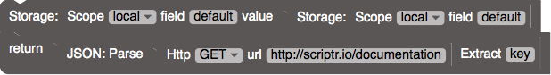
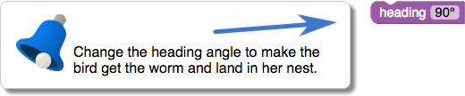
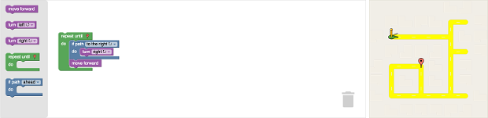
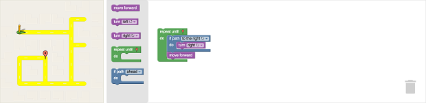
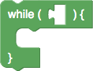

# 最佳实践

多年来，Blockly和Blockly Games团队已经吸取了许多教训，适用于开发基于Blockly的应用程序的那些人。 以下是我们犯过的错误或其他人常见的错误的集合。

这些是我们使用Blockly的视觉样式学到的一般课程，可能并不适用于所有用例或设计。 可能存在其他解决方案。 这也不是用户可能遇到的问题以及如何避免它们的详尽列表。 每种情况都略有不同，可能会有其取舍。

## 1.边框样式

在2000年代，“ Aqua”外观具有风格，屏幕上的每个对象都装饰有高光和阴影。 在2010年代，“材料设计”外观具有风格，每个屏幕上的对象都简化为干净，平坦，无边界的形状。 大多数块编程环境在每个块周围都有突出显示和阴影，因此，当当今的图形设计师看到这一点时，他们总是会剥去这些过时的装饰。

从上面的五个图块示例中可以看出（来自scriptr.io），这些“过时的装饰”对于区分相同颜色的连接图块至关重要。

建议：如果要重新调整Blockly的外观，请不要让当今的时尚破坏您的应用程序。

## 2.嵌套子堆栈

"C"字形块始终在内部顶部具有连接器，但是某些环境在内部底部也具有连接器（例如Wonder Workshop），而其他环境则没有（例如Blockly和Scratch）。 由于大多数语句块同时具有顶部和底部连接器，因此某些用户不会立即看到该语句将适合没有底部连接器的'C'。

一旦用户确定一个语句块可放入“ C”中，则需要确定一个语句块也将适用。 某些环境将第一个语句的下层连接嵌套到“ C”的底部（例如，Wonder Workshop和Scratch），而其他环境则留有很小的差距（例如，块状）。 紧密嵌套不会暗示可以叠放更多的块。

这两个问题相互影响很严重。 如果存在内部的底部连接器（Wonder Workshop），则使初始语句的连接更加明显，但这么做会降低发现块可叠放的能力。 如果不存在内部的底部连接器（Blockly），则初始语句的连接不明显，但更容易发现这里可以叠放块。 当使用Blockly测试时，没有内部底部连接器并嵌套该语句的底部连接器（Scratch）对于可发现性而言效果最差。

我们的经验是，与发现某处可叠放相比，初始语句的连接对用户来说是一个较小的挑战。 一旦发现，就永远不会忘记前者，而后者则需要提示。 Blockly尝试了Wonder Workshop和Scratch方法，直到有一天出现渲染错误。 由于这个错误，我们发现Blockly在用户研究方面有了显着的进步（现在我们为之骄傲的一个“功能”）。

建议：如果要重新调整皮肤的外观，请保留现有的堆叠UI。

## 3.对称连接

Blockly具有两种不同的连接类型：水平拼图形状和垂直堆叠槽口。 良好的用户界面应努力减少设计元素的数量。 因此，许多设计人员试图使两种连接类型看起来相同（如下所示）。

结果使新用户在寻找旋转块的方式时感到困惑，因为他们可以适应不兼容的连接。 块状地使编程元素可视且有形，因此必须谨记不经意地建议不支持的用户交互。

因此，Blockly将紧密配合的拼图形状用于值连接，并将视觉上不同的对齐切口用于语句堆叠。

建议：如果要重新换块，请确保水平和垂直连接看起来不同。

## 4.变量和函数名

新手程序员不希望location_X 和location_x 是不同的变量。 因此，Blockly通过使变量和函数不区分大小写来遵循BASIC和HTML的要求。 Scratch使用更微妙的方法（如下图所示），并且变量名区分大小写，但相等性检查不区分大小写。

同样，Blockly不需要变量和函数符合典型的[_A-Za-z] [_A-Za-z0-9] *方案。 如果要命名一个可变的邮政编码列表或רשימתמיקודים列表，那也是完全可行的。

建议：忽略大小写，允许使用任何名称。

## 5.全局变量

新手程序员也很难理解使用范围这个概念。 因此，Blockly效仿Scratch,通过使所有变量都成为全局变量。 全局变量唯一的缺点是递归比较棘手（必须将变量推入并弹出到列表中），但这是一种编程技术，超出了Blockly目标用户的范围。

建议：范围超出范围，请留待以后使用。

## 6.使用说明

Blockly Games专为自学而设计，不需要老师或课程计划。 为此，Blockly Games的第一版在每个级别上都有说明。 大多数学生不会阅读它们。 我们将它们简化为一个句子，增加了字体大小，并以黄色气泡突出显示了它们。 大多数学生依然不会阅读它们。 我们使用说明创建了模式弹出窗口。 大多数学生本能地关闭弹出窗口而不阅读它们，然后不知道该怎么办了。

最后，我们创建了无法关闭的弹出窗口。 它们被编程为监视学生的动作，并且仅在学生执行了被禁止的动作时才自行关闭。 这些上下文相关的弹出窗口很难编程，但是非常有效。 对于他们来说，在不干扰工作空间的情况下进入视野也很重要。

建议：说明应简短而持久，但不要令人讨厌。

## 7.代码所有权

旨在教授特定概念的练习通常会提供部分解决方案，学生需要对其进行修改以达到所需的效果。 在Blockly中创建了一类不可编辑，不可移动，不可删除的块来支持这一点。 但是，学生讨厌进行这些空白练习, 他们对解决方案没有自主感。

设计教授相同概念的自由形式练习更具挑战性。 一种被证明是成功的技术是将学生自己的解决方案用于一项练习，作为下一项练习的起点。

建议：不要为用户编写代码。

## 8.工作区布局

有两种合理的方式从左到右布局屏幕。 一种方法是从左侧的工具栏，中间的工作区和右侧的输出可视化开始。 此布局由Scratch1版本和“Made with Code”使用。

另一种方法是从左侧的输出可视化，中间的工具栏和右侧的工作区开始。 Scratch的版本2和大多数Blockly应用程序都使用此布局。

无论哪种情况，工作区都应伸展以占用可用的屏幕尺寸-用户需要尽可能多的程序空间。 从上面的屏幕快照中可以看出，由于用户代码和输出可视化是分开的，因此第一种布局在宽屏上的效果不佳。 而第二种布局则为大型程序提供了额外的空间，同时仍将所有三个部分保持在一起。

对于用户来说，首先思考他们要解决的问题，然后检查可用的工具，然后才开始编程，这样在逻辑上才是有意义的。

当然，对于阿拉伯语和希伯来语翻译，需要翻转整个顺序。

在某些情况下，例如使用少量的简单块时，将工具箱置于工作空间之上或之下可能是有意义的。 在这种情况下，Blockly支持在工具箱中进行水平滚动，但应谨慎使用。

建议：将程序可视化文件放在工具栏旁边。

## 9.退出策略

基于拖块的编程通常是编程的起点。 在计算机编程教学的背景下，它是一种入门的方式，可以使学生产生兴趣，然后再进行更艰巨的工作。 这个基于拖块的编程阶段应该为学生持续多长时间一直是一个难以解决的问题，但是如果您的目标是教编程，那应该是暂时的。

鉴于此，用于教学编程的基于拖块的编程环境必须具有适合其学生的方法。 Blockly Games有四种策略：

1. 块上的所有文本（例如“ if”，“ while”）均小写，以匹配基于文本的编程语言
2. 学生代码的JavaScript版本始终在每个级别之后显示，以增加熟悉度
3. 在倒数第二个游戏中，将块文本替换为实际的JavaScript（如下图所示）。 此时，学生正在使用JavaScript编程
4. 在最终游戏中，块编辑器被替换为文本编辑器

用于教学编程的基于拖块的编程环境需要制定具体计划来毕业。 合理的退出机制对于解决那些认为基于拖块的编程不是“真正的编程”的人还有很大帮助。

建议：考虑用户的最终目标并进行适当设计。