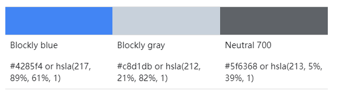
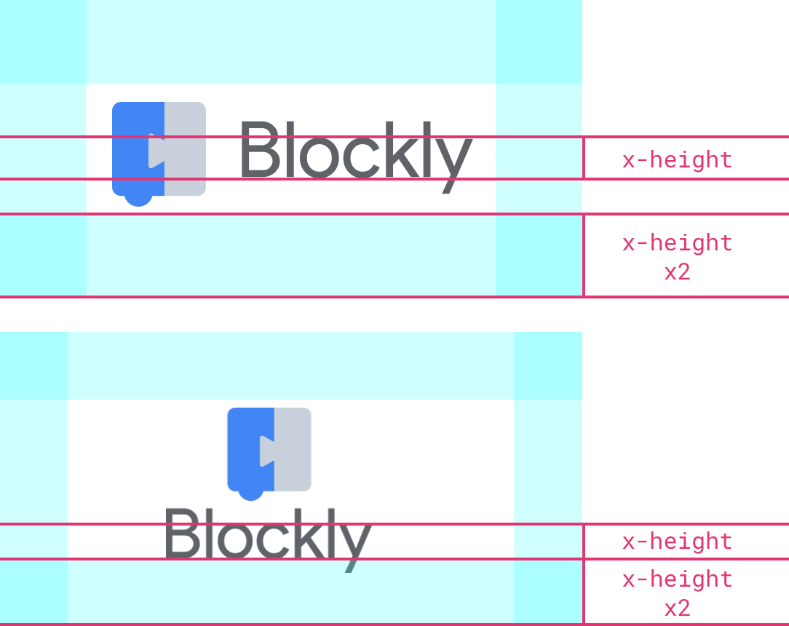

# 参考blockly

Blockly的代码是开源的，可以免费使用而无需注明出处。

但是，我们确实鼓励使用Blockly在其网站，应用程序或产品中引用产品的开发人员。 本页介绍了最佳参考做法，以供参考以及对其进行归因以及徽标的正确使用。

[点击此处](https://developers.google.com/blockly/images/logos/blockly_logos_all.zip) 下载图标(需要科学上网)

## 如何参考Blockly

### 文字说明来源

在段落中首次引用时，请使用主要的单行描述：

    Blockly is a library from Google for building beginner-friendly block-based programming languages.
    Blockly是Google的一个库，用于构建对初学者友好的基于块的编程语言。

在使用Blockly的另一个应用程序的上下文中提及Blockly时，应使用短语“ Built on Blockly”作为开发人员库的归属。如果在构建应用程序时使用了其他工具或库，则可以使用“ Built with Blockly”。 如果使用的主要库是Blockly，则使用“ Built on Blockly”。

在给出“Blockly attribution”时，此短语应用于博客文章，新闻采访，应用程序以及您的网站上。

## 建议: 做与不要做

要做: 呼叫Blockly是“初学者友好的”，而不是“孩子友好的”。 Blockly用于各种应用程序，但并非所有应用程序都以儿童为中心。

不要做: 将Blockly称为一种语言（例如，称为“基于块的编程语言”）。 Blockly不是一种语言，它是开发人员用来制作语言的工具或库。

## 如何形象地表示Blockly

### 加上源自Blockly的图标

要在您的应用或网站中提供源自Blockly图标，请根据背景颜色使用以下徽标之一：

|  |    |    | 
| :-: | :-: | :-: | 
| 适用于形状重叠或图案变化的浅色背景。 | 对于形状重叠或图案变化的深色背景。 | 对于高对比度的深色背景（无形状或图案）。 |  
| [PNG](file:///C:/Users/zyl/Downloads/blockly-guide/Representing%20the%20Blockly%20brand%20%C2%A0_%C2%A0%20Google%20Developers_files/logo_built_on.png) [SVG](https://developers.google.com/blockly/images/logos/logo_built_on.svg) | [PNG](https://developers.google.com/blockly/images/logos/logo_built_on_dark.png) [SVG](https://developers.google.com/blockly/images/logos/logo_built_ondark.svg) | [PNG](https://developers.google.com/blockly/images/logos/logo_built_on_knockout.png) [SVG](https://developers.google.com/blockly/images/logos/logo_built_on_knockout.svg) |  

## Blockly logo的其他用途

未经Blockly团队允许，请勿将Blockly商标或Blockly商标的任何变体与您的应用程序，产品，服务或网站的整体名称结合使用（请发送电子邮件至blockly-support@google.com以请求许可）。 请勿以可能造成混淆或误导的方式更改或使用Blockly标记，切勿将Blockly品牌用作页面上最突出的元素。

|  |  标准锁定  标准锁定可以在幻灯片和博客文章中使用。 只要有可能，徽标应表示为带有全色徽标和中性700（＃5F6368）或纯白色徽标的水平锁。   | 
| :-: | :-: | 

|  |    |    | 
| :-: | :-: | :-: | 
| 当水平空间有限时，可以将垂直锁定与全彩徽标和中性700（＃5F6368）或纯白色徽标一起使用。 | 当垂直和水平空间有限时，可以单独使用徽标，而无需使用徽标。 | 当徽标的颜色与背景的对比度差时，可以使用纯白色的剔除版本。 |  
| [PNG](./logo_vertical.png) [SVG](https://developers.google.com/blockly/images/logos/logo_vertical.svg) | [PNG](./logo_only.png) [SVG](https://developers.google.com/blockly/images/logos/logo_only.svg) | [PNG](https://developers.google.com/blockly/images/logos/logo_knockout.png) [SVG](https://developers.google.com/blockly/images/logos/logo_knockout.svg) |  

### logo颜色

### 大小和间距

为确保清晰易读，徽标的高度不得小于24像素。

对于锁定，在徽标周围至少留出x高度x2的白色空间。 切勿使徽标与其他元素拥挤或重叠。

## 一般错误

请不要做以下事情...

* 以任何方式更改或扭曲徽标
* 使用除白色以外的任何颜色的白色剔除
* 更改颜色，形状或角度
* 沿任何方向旋转或翻转
* 更改比例，位置或位置
* 用其他字体替换徽标
* 使用旧的Blockly徽标（方便时应更新现有用法）
* 将徽标用于对比度较差的背景（例如，浅灰色背景上的剔除徽标）
* 将徽标与其他元素重叠或拥挤
* 重新绘制徽标
* 结合使用其他Google品牌和您的产品

有关如何使用其他Google品牌的指南，请访问[品牌许可网站](https://www.google.com/permissions/)。