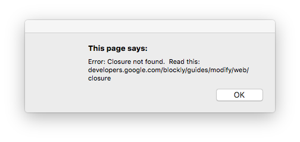
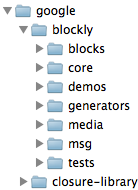

# closure库

你收到以下报错信息了吗?

如果是这样，则您可能正在尝试运行或构建Blockly的未压缩版本，并且缺少对[Closure Library(https://developers.google.com/closure/library/)]的依赖。

## 获取Closure

可以便捷的从GitHub上获取Closure

拥有Closure文件后，将它们放置在Blocky的根目录旁边，并确保该目录名为closure-library。 这是您想要的目录结构：

现在，Blockly应该可以在未压缩模式下构建和工作。