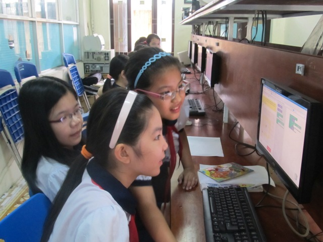

# 翻译

在学习计算机科学概念时，学生不必在学习英语的同时费劲。 如果您以英语以外的其他语言为母语，那么我们很感谢您为世界上95％的母语不是英语的人所提供的帮助。

## Translatewiki

Blockly和Blockly游戏的翻译均由Translatewiki处理。

1. 注册成为translatewiki.net的翻译。
2. 做一些测试翻译以获得翻译许可（在右上角选择一种语言）。
3. 简要阅读Blockly的翻译风格指南。
4. 转到Blockly的消息组（在右上角选择一种语言），然后开始翻译！
5. 新翻译可能需要几个月才能显示在实时网站上。

请注意，Translatewiki不支持Klingon，因此需要单独处理语言。

